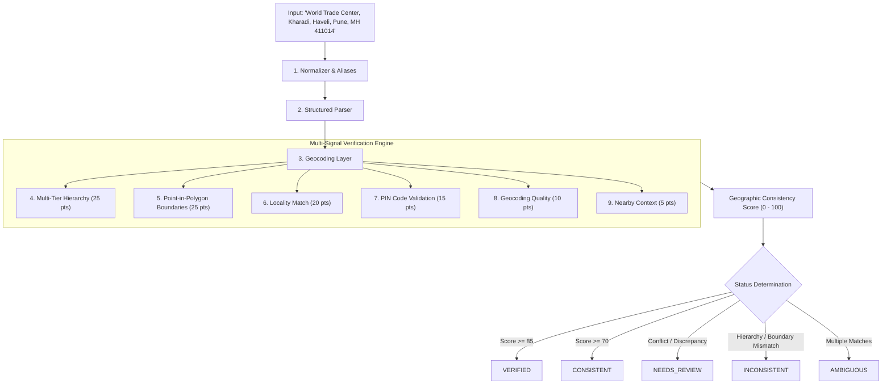

# GeoVerify India 🇮🇳

[](https://github.com/maneaditya478-commits/GeoVerify/actions/workflows/ci.yml)
[](LICENSE)
[](https://www.python.org/)
[](https://react.dev/)
[](https://fastapi.tiangolo.com/)
[](backend/tests)

**GeoVerify India** is an open-source address intelligence and geographic consistency verification platform tailored for the unique administrative and spatial complexities of Indian addresses.

---

## 1. Problem Statement

Indian addresses are characterized by diverse informal formatting, colloquial locality names, transliteration variations in regional scripts (Hindi, Marathi), municipal ward reorganizations, and multi-tier administrative subdivisions (Tehsils, Talukas, Postal Circles).

Traditional address verification systems suffer from:
* **Binary "fake or real" false positives** due to simple spelling variations or abbreviations (`Maharastra` vs `Maharashtra`, `BLR` vs `Bengaluru`, `महाराष्ट्र` vs `Maharashtra`).
* **Silent geocoding errors** where an address in one district is placed in another without administrative validation.
* **Lack of explainability**, providing black-box confidence scores without actionable evidence.

---

## 2. Solution: Multi-Signal Consistency Verification

GeoVerify India determines whether components of an address are **geographically and administratively consistent**.

> **Note on Privacy & Objective:** GeoVerify India does **NOT** claim or verify that a specific person resides at an address. It verifies the geographic existence, administrative hierarchy, and spatial consistency of the supplied address components.



---

## 3. Key Features (Phase 2)

- **Scalable Data Ingestion Pipeline**: Ingests authoritative datasets from Local Government Directory (LGD), Survey of India (SOI), Department of Posts (India Post), and OpenStreetMap (OSM) under **GODL-India** and **ODbL** licenses.
- **Multi-Tier Administrative Hierarchy**:
  $$\text{Country} \rightarrow \text{State} \rightarrow \text{District} \rightarrow \text{Sub-District (Taluka/Tehsil/Mandal)} \rightarrow \text{Locality}$$
- **Native Script & Transliteration Support**: Normalizes and matches English, Devanagari Hindi (`महाराष्ट्र`, `कर्नाटक`, `दिल्ली`), and Marathi variants.
- **Isolated PIN Code Breakdown**: Separates 6-digit formatting, postal circle alignment, district cross-referencing, and centroid distance checks.
- **Authoritative Boundary Verification**: Point-in-Polygon containment tests using Shapely with state, district, and subdistrict polygons.
- **Geographic Directory Exploration API**: Fast directory endpoints to search and inspect Indian states, districts, sub-districts, and PIN codes.
- **Interactive GIS Dashboard**: Dark-mode React + Leaflet interface with GeoJSON boundary rendering, score gauges, evidence audit trail, and authoritative provenance cards.

---

## 4. Verification Classifications

| Status | Meaning | Typical Scenario |
| :--- | :--- | :--- |
| `VERIFIED` | Strong geographic and administrative consistency. | Locality, subdistrict, district, state, coordinates, and PIN code fully align ($Score \ge 85$). |
| `CONSISTENT` | Most evidence agrees with minor omissions. | Valid address missing optional landmarks or sub-district ($Score \ge 70$). |
| `NEEDS_REVIEW` | Discrepancy or incomplete data requiring review. | PIN circle differs from state, or coordinate distance exceeds 20 km. |
| `INCONSISTENT` | Critical administrative/boundary mismatch. | `Kharadi, Kolhapur, Maharashtra` (Locality belongs to Pune, not Kolhapur). |
| `AMBIGUOUS` | Multiple geographic entities match. | `Rampur` without state, district, or PIN code disambiguation. |
| `UNABLE_TO_VERIFY`| Insufficient information. | Input cannot be parsed into recognizable geographic tokens. |

---

## 5. Technology Stack

### Backend
- **Python 3.11+ / 3.13**
- **FastAPI**: Asynchronous REST API framework
- **Pydantic v2**: Data validation and strict schemas
- **SQLAlchemy 2.0**: ORM and relational models (PostGIS & SQLite support)
- **Shapely**: Point-in-polygon spatial containment
- **RapidFuzz**: High-performance fuzzy matching
- **Pytest**: 52 passing backend tests

### Frontend
- **React 18 & Vite**
- **TypeScript**: Strict type safety
- **Tailwind CSS**: Professional dark GIS interface
- **Leaflet & React-Leaflet**: Interactive map rendering and GeoJSON layers
- **TanStack React Query**: Asynchronous state management
- **Lucide React**: Vector icons

---

## 6. Getting Started Locally

### 1. Clone the repository
```bash
git clone https://github.com/maneaditya478-commits/GeoVerify.git
cd GeoVerify
```

### 2. Set up Backend
```bash
# Create and activate virtual environment
python -m venv backend/.venv
.\backend\.venv\Scripts\Activate.ps1  # On Linux/macOS: source backend/.venv/bin/activate

# Install Python requirements
pip install -r backend/requirements.txt

# Run Data Ingestion & Transformation Pipeline
python data/scripts/download/fetch_sources.py
python data/scripts/transform/transform_admin_data.py
python data/scripts/validate/validate_geography.py
python data/scripts/import/import_postgis.py

# Start Backend Server
uvicorn app.main:app --app-dir backend --reload --port 8000
```
- Backend API: `http://localhost:8000`
- Swagger UI Docs: `http://localhost:8000/docs`

### 3. Set up Frontend
```bash
cd frontend
npm install
npm run dev
```
- Frontend: `http://localhost:5173`

---

## 7. Running Tests

### Backend Unit & Integration Tests (52 Tests)
```powershell
$env:PYTHONPATH="backend"
.\backend\.venv\Scripts\python -m pytest backend/tests -v
```

### Frontend Typecheck & Build
```powershell
cd frontend
npm run build
```

---

## 8. API Reference

### Verify Address
```bash
curl -X POST "http://localhost:8000/api/verify" \
  -H "Content-Type: application/json" \
  -d '{
    "address": "World Trade Center, Kharadi, Haveli, Pune, Maharashtra 411014",
    "radius_km": 5.0
  }'
```

### Geographic Directory API
- `GET /api/geography/states`: List 36 States & UTs with LGD codes.
- `GET /api/geography/districts?state_code=MH`: List districts for a state.
- `GET /api/geography/subdistricts?district_id=dist_pune`: List talukas / tehsils.
- `GET /api/geography/pincode/411014`: Lookup PIN code circle and centroid.
- `GET /api/geography/search?q=Kharadi`: Multilingual search across all entities.

---

## 9. Privacy & Ethical Guidelines

1. **No Resident Profiling**: GeoVerify verifies geographic consistency, never personal residence.
2. **Data Minimization**: Submissions are not retained permanently by default.
3. **No Black-Box Arbitrary Classifications**: Every score is 100% transparent and deterministic.

---

## 10. License

This project is licensed under the [MIT License](LICENSE). Datasets are ingested under **GODL-India** and **ODbL**.
