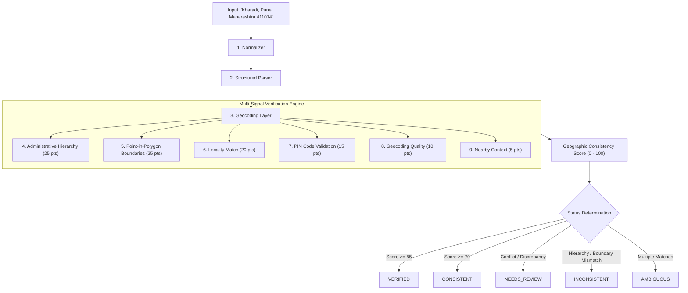

# GeoVerify India 🇮🇳

[](https://github.com/maneaditya478-commits/GeoVerify/actions/workflows/ci.yml)
[](LICENSE)
[](https://www.python.org/)
[](https://react.dev/)
[](https://fastapi.tiangolo.com/)

**GeoVerify India** is an open-source address intelligence and geographic consistency verification platform tailored for the unique complexities of Indian addresses.

---

## 1. Problem Statement

Indian addresses are characterized by diverse informal formatting, colloquial locality names, transliteration variations, dynamic municipal ward demarcations, and complex administrative subdivisions (Tehsils, Talukas, Postal Circles).

Traditional address verification systems suffer from:
* **Binary "fake or real" false positives** due to simple spelling variations or abbreviations (`Maharastra` vs `Maharashtra`, `BLR` vs `Bengaluru`).
* **Silent geocoding errors** where an address in one district is placed in another without administrative validation.
* **Lack of explainability**, providing black-box confidence scores without actionable evidence.

---

## 2. Solution: Multi-Signal Consistency Verification

GeoVerify India determines whether components of an address are **geographically and administratively consistent**.

> **Note on Privacy & Objective:** GeoVerify India does **NOT** claim or verify that a specific person resides at an address. It verifies the geographic existence, administrative hierarchy, and spatial consistency of the supplied address components.



---

## 3. Key Features

- **Multi-Signal Verification Engine**: Independently analyzes administrative hierarchy, geometric boundaries, locality existence, postal codes, and nearby context.
- **Rule & Dictionary-Based Address Normalization**: Standardizes punctuation, expands Indian abbreviations (`Rd` ➔ `Road`, `Bhd` ➔ `Behind`), resolves state/district aliases (`MH` ➔ `Maharashtra`, `Poona` ➔ `Pune`, `BLR` ➔ `Bengaluru Urban`).
- **Structured Address Parser**: Automatically extracts premise, locality, sub-district, district, state, PIN code, and landmarks from free-form strings.
- **Authoritative Boundary Verification**: Point-in-Polygon containment tests with Shapely against state, district, and locality polygons.
- **Postal Code Intelligence**: 6-digit PIN validation, circle mapping, and centroid distance checks.
- **Nearby Geographic Intelligence**: Computes distances to nearby transit hubs, hospitals, police stations, and commercial centers.
- **Explainable Results**: Provides human-readable forensic breakdown of passing, warning, and conflicting signals.
- **Interactive GIS Dashboard**: Modern React + Leaflet interface with dark map tiles, GeoJSON boundary rendering, score gauges, and history inspection.

---

## 4. Verification Classifications

| Status | Meaning | Typical Scenario |
| :--- | :--- | :--- |
| `VERIFIED` | Strong geographic and administrative consistency. | Locality, district, state, coordinates, and PIN code fully align ($Score \ge 85$). |
| `CONSISTENT` | Most evidence agrees with minor omissions. | Valid address missing optional landmarks or sub-district ($Score \ge 70$). |
| `NEEDS_REVIEW` | Discrepancy or incomplete data requiring review. | PIN circle differs from state, or coordinate distance exceeds 20 km. |
| `INCONSISTENT` | Critical administrative/boundary mismatch. | `Kharadi, Kolhapur, Maharashtra` (Locality belongs to Pune, not Kolhapur). |
| `AMBIGUOUS` | Multiple geographic entities match. | `Rampur` without state, district, or PIN code disambiguation. |
| `UNABLE_TO_VERIFY`| Insufficient information. | Input cannot be parsed into recognizable geographic tokens. |

---

## 5. Technology Stack

### Backend
- **Python 3.11+ / 3.13**
- **FastAPI**: Asynchronous REST API framework
- **Pydantic v2**: Data validation and strict schemas
- **SQLAlchemy 2.0**: ORM and relational models
- **Shapely & GeoPandas**: Point-in-polygon spatial containment
- **RapidFuzz**: High-performance fuzzy matching
- **Pytest**: Comprehensive test suite

### Frontend
- **React 18 & Vite**
- **TypeScript**: Strict type safety
- **Tailwind CSS**: Professional dark GIS interface
- **Leaflet & React-Leaflet**: Interactive map rendering and GeoJSON layers
- **TanStack React Query**: Asynchronous state management
- **Lucide React**: Vector icons

### Infrastructure
- **Docker & Docker Compose**
- **PostgreSQL 16 & PostGIS 3.4**
- **GitHub Actions**: Continuous Integration

---

## 6. Getting Started Locally

### Prerequisites
- Python 3.11+
- Node.js 18+ and npm
- (Optional) Docker & Docker Compose

### Option A: Local Development Setup

#### 1. Clone the repository
```bash
git clone https://github.com/maneaditya478-commits/GeoVerify.git
cd GeoVerify
```

#### 2. Set up Backend
```bash
# Create and activate virtual environment
python -m venv backend/.venv
source backend/.venv/bin/activate  # On Windows: .\backend\.venv\Scripts\Activate.ps1

# Install Python requirements
pip install -r backend/requirements.txt

# Generate Reference Datasets
python data/scripts/generate_seed_data.py

# Start Backend Server
uvicorn app.main:app --app-dir backend --reload --port 8000
```
Backend API will be running at `http://localhost:8000`.
Swagger docs: `http://localhost:8000/docs`

#### 3. Set up Frontend
```bash
cd frontend
npm install
npm run dev
```
Frontend will be running at `http://localhost:5173`.

---

### Option B: Docker Compose

Start the entire environment with a single command:
```bash
docker compose up --build
```
- Frontend: `http://localhost:3000`
- Backend API: `http://localhost:8000`
- PostGIS Database: `localhost:5432`

---

## 7. Running Tests

### Backend Unit & Integration Tests
```bash
# Run pytest with full verbosity
PYTHONPATH=backend pytest backend/tests -v
```

### Frontend Typecheck & Build
```bash
cd frontend
npm run build
```

---

## 8. API Reference

### Verify Address
```bash
curl -X POST "http://localhost:8000/api/verify" \
  -H "Content-Type: application/json" \
  -d '{
    "address": "Kharadi, Pune, Maharashtra 411014",
    "radius_km": 5.0
  }'
```

### Response Example:
```json
{
  "verification_id": "gv_a1b2c3d4e5f6",
  "status": "VERIFIED",
  "score": 94,
  "summary": "Strong geographic, administrative, and geometric consistency verified across all signals.",
  "explanation": [
    "✓ State 'Maharashtra' exists",
    "✓ District 'Pune' belongs to declared state",
    "✓ Coordinates fall within expected district (Pune)",
    "✓ Locality 'Kharadi' identified and consistent",
    "✓ PIN code '411014' is consistent with postal circle and region",
    "✓ Found 8 contextual geographic landmarks nearby"
  ],
  "warnings": [],
  "score_breakdown": {
    "hierarchy_score": 25.0,
    "boundary_score": 25.0,
    "locality_score": 20.0,
    "pincode_score": 15.0,
    "geocoding_score": 9.5,
    "nearby_score": 5.0,
    "total_score": 94
  },
  "geocoding": {
    "coordinates": { "latitude": 18.5514, "longitude": 73.9405 },
    "display_name": "Kharadi, Pune, Maharashtra"
  }
}
```

---

## 9. Privacy & Ethical Guidelines

1. **No Resident Profiling**: GeoVerify verifies geographic consistency, never personal residence.
2. **Data Minimization**: Submissions are not retained permanently by default.
3. **No Black-Box Arbitrary Classifications**: Every score is 100% transparent and deterministic.

---

## 10. License

This project is licensed under the [MIT License](LICENSE).
