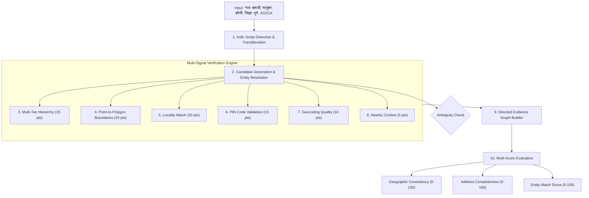

# GeoVerify India 🇮🇳

[](https://github.com/maneaditya478-commits/GeoVerify/actions/workflows/ci.yml)
[](LICENSE)
[](https://www.python.org/)
[](https://react.dev/)
[](https://fastapi.tiangolo.com/)
[](backend/tests)

**GeoVerify India** is an open-source address intelligence, entity resolution, and geographic consistency verification platform tailored for the unique administrative and spatial complexities of Indian addresses.

---

## 1. Problem Statement

Indian addresses are characterized by diverse informal formatting, colloquial locality names, transliteration variations in regional scripts (Hindi, Marathi), municipal ward reorganizations, and multi-tier administrative subdivisions (Tehsils, Talukas, Postal Circles).

Traditional address verification systems suffer from:
* **Binary "fake or real" false positives** due to simple spelling variations or abbreviations (`Maharastra` vs `Maharashtra`, `BLR` vs `Bengaluru`, `महाराष्ट्र` vs `Maharashtra`).
* **Silent geocoding errors** where an address in one district is placed in another without administrative validation.
* **Lack of explainability**, providing black-box confidence scores without actionable evidence.
* **Homonymous geographic confusion** between identically named towns across different states (e.g., *Bilaspur* in Chhattisgarh vs Himachal Pradesh, *Rampur* across multiple states).

---

## 2. What GeoVerify Can vs Cannot Establish

### What GeoVerify Can Establish:
* Authoritative administrative consistency between Locality, Sub-District (Taluka), District, State, and PIN code.
* Whether an asserted geographic entity exists in official Indian registries (Local Government Directory and India Post).
* Geometric point-in-polygon containment against official state and district boundaries.
* Homonymous ambiguities and specific required fields needed for disambiguation.
* Structural address completeness across 6 administrative dimensions.

### What GeoVerify Cannot Establish:
* Physical presence or residency of a specific individual or business at an address.
* Deliverability of mail inside private apartment gates or internal unit numbers.
* Ownership or legal title of private properties.

---

## 3. Architecture & Multi-Score Pipeline



---

## 4. Key Features (Phase 3)

- **Deterministic Address Entity Resolution Layer**: Multi-factor candidate ranking across name similarity ($40\%$), administrative context ($25\%$), PIN compatibility ($15\%$), geographic proximity ($15\%$), and entity type ($5\%$).
- **Multi-Location Ambiguity Detection**: Flags homonymous locations and provides actionable disambiguation guidance (e.g. `+ State name`, `+ PIN code`).
- **Address Completeness Scoring ($0 - 100$)**: Evaluates presence of premise, road, locality, sub-district, district, state, and PIN code with transparent ratings (`COMPLETE`, `ADEQUATE`, `PARTIAL`, `MINIMAL`).
- **Directed Evidence Graph Model**: Graph nodes and directional relationships with explicit severity classifications (`INFO`, `WARNING`, `CONFLICT`) and Cytoscape/JSON export.
- **Native Indic Script & Transliteration**: Detects `Latin`, `Devanagari`, or `Mixed` scripts; extracts Indic prefixes (`गाव:`, `तालुका:`, `जिल्हा:`, `राज्य:`, `पिन:`); transliterates Hindi/Marathi entities.
- **Scalable Data Ingestion Pipeline**: Ingests authoritative datasets from Local Government Directory (LGD), Survey of India (SOI), Department of Posts (India Post), and OpenStreetMap (OSM) under **GODL-India** and **ODbL** licenses.
- **Comprehensive Benchmark Test Suite**: 18 test cases across 9 categories (`tests/fixtures/address_benchmark.json`) and **82 passing backend tests**.
- **Interactive GIS Dashboard**: Dark-mode React + Leaflet interface with Address Interpretation card, Ambiguity card, Evidence Graph visualizer, Multi-Score gauges, and Leaflet layer toggles.

---

## 5. Verification Classifications

| Status | Meaning | Typical Scenario |
| :--- | :--- | :--- |
| `VERIFIED` | Strong geographic and administrative consistency. | Locality, subdistrict, district, state, coordinates, and PIN code fully align ($Score \ge 85$). |
| `CONSISTENT` | Most evidence agrees with minor omissions. | Valid address missing optional landmarks or sub-district ($Score \ge 70$). |
| `NEEDS_REVIEW` | Discrepancy or incomplete data requiring review. | PIN circle differs from state, or coordinate distance exceeds 20 km. |
| `INCONSISTENT` | Critical administrative/boundary mismatch. | `Kharadi, Kolhapur, Maharashtra` (Locality belongs to Pune, not Kolhapur). |
| `AMBIGUOUS` | Multiple geographic entities match. | `Rampur` without state, district, or PIN code disambiguation. |
| `UNABLE_TO_VERIFY`| Insufficient information. | Input cannot be parsed into recognizable geographic tokens. |

---

## 6. Technology Stack

### Backend
- **Python 3.11+ / 3.13**
- **FastAPI**: Asynchronous REST API framework
- **Pydantic v2**: Data validation and strict schemas
- **SQLAlchemy 2.0**: ORM and relational models (PostGIS & SQLite support)
- **Shapely**: Point-in-polygon spatial containment
- **RapidFuzz**: High-performance fuzzy matching
- **Pytest**: 82 passing backend tests (100% pass rate)

### Frontend
- **React 18 & Vite**
- **TypeScript**: Strict type safety
- **Tailwind CSS**: Professional dark GIS interface
- **Leaflet & React-Leaflet**: Interactive map rendering and GeoJSON layers
- **TanStack React Query**: Asynchronous state management
- **Lucide React**: Vector icons

---

## 7. Getting Started Locally

### 1. Clone the repository
```bash
git clone https://github.com/maneaditya478-commits/GeoVerify.git
cd GeoVerify
```

### 2. Set up Backend
```bash
# Create and activate virtual environment
python -m venv backend/.venv
.\backend\.venv\Scripts\Activate.ps1  # On Linux/macOS: source backend/.venv/bin/activate

# Install Python requirements
pip install -r backend/requirements.txt

# Run Data Ingestion & Transformation Pipeline
python data/scripts/download/fetch_sources.py
python data/scripts/transform/transform_admin_data.py
python data/scripts/validate/validate_geography.py
python data/scripts/import/import_postgis.py

# Start Backend Server
uvicorn app.main:app --app-dir backend --reload --port 8000
```
- Backend API: `http://localhost:8000`
- Swagger UI Docs: `http://localhost:8000/docs`

### 3. Set up Frontend
```bash
cd frontend
npm install
npm run dev
```
- Frontend: `http://localhost:5173`

---

## 8. Running Tests

### Backend Unit & Integration Tests (82 Tests)
```powershell
$env:PYTHONPATH="backend"
.\backend\.venv\Scripts\python -m pytest backend/tests -v
```

### Frontend Typecheck & Build
```powershell
cd frontend
npm run build
```

---

## 9. API Reference

### Verify Address
```bash
curl -X POST "http://localhost:8000/api/verify" \
  -H "Content-Type: application/json" \
  -d '{
    "address": "World Trade Center, Kharadi, Haveli, Pune, Maharashtra 411014",
    "radius_km": 5.0
  }'
```

### Address Entity Resolution & Ambiguity
- `POST /api/address/resolve`: Full entity resolution with candidate match scoring.
- `GET /api/address/candidates?q=Kharadi&state=Maharashtra`: Search candidates.
- `POST /api/address/ambiguity`: Detect homonymous geographic ambiguity.
- `POST /api/address/completeness`: Calculate Address Completeness Score ($0-100$).
- `GET /api/evidence/{verification_id}`: Retrieve Directed Evidence Graph.

---

## 10. Privacy & Ethical Guidelines

1. **No Resident Profiling**: GeoVerify verifies geographic consistency, never personal residence.
2. **Data Minimization**: Submissions are not retained permanently by default.
3. **No Black-Box Arbitrary Classifications**: Every score is 100% transparent and deterministic.

---

## 11. License

This project is licensed under the [MIT License](LICENSE). Datasets are ingested under **GODL-India** and **ODbL**.
