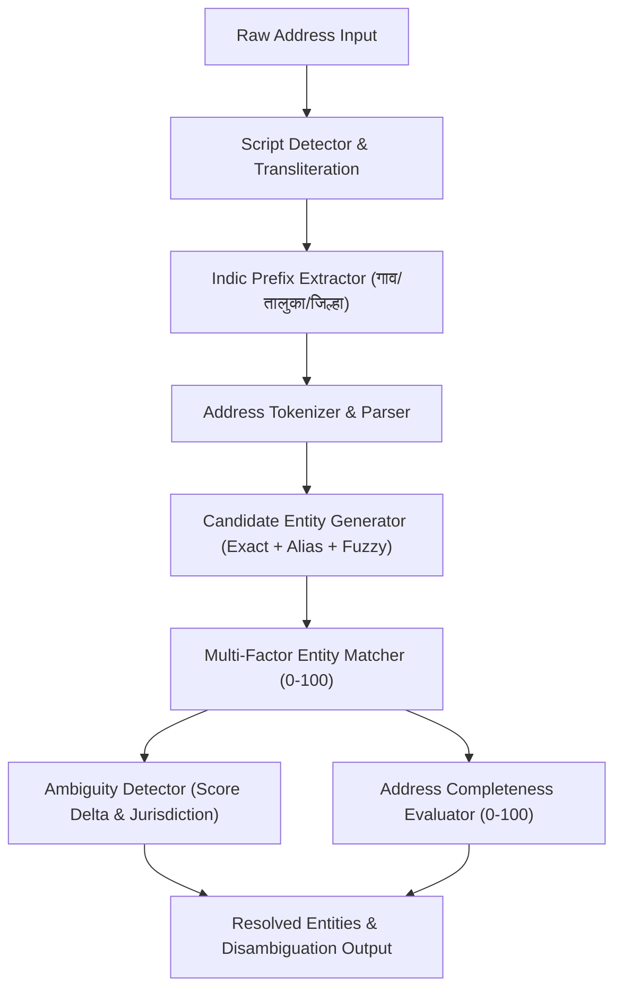

# Address Intelligence & Entity Resolution

## 1. Overview

GeoVerify India uses a deterministic, rule-and-gazetteer-driven **Address Entity Resolution Layer** to resolve ambiguous, incomplete, multilingual, or slightly misspelled address components into authoritative geographic entities defined in official Indian administrative registries (Local Government Directory and Department of Posts).

---

## 2. Candidate Generation

The `CandidateGenerator` queries indexed official administrative records across 4 hierarchical tiers:
1. **States & Union Territories** (36 LGD entities)
2. **Districts** (700+ official districts with regional/historical aliases, e.g., *Poona* → *Pune*, *Calcutta* → *Kolkata*)
3. **Sub-Districts / Talukas / Tehsils** (6,000+ administrative subdivisions)
4. **Localities & Urban Suburbs** (Major urban hubs, towns, and villages)

### Matching Strategies:
* **Exact Matching:** Case-insensitive canonical match.
* **Alias Matching:** Multi-lingual historical aliases, alternate spellings, and acronyms (e.g., *MH* → *Maharashtra*, *BLR* → *Bengaluru*).
* **Transliteration Matching:** Matches Devanagari and Latin equivalents using bidirectional mapping tables.
* **Fuzzy Phonetic Matching:** RapidFuzz token sort and Levenshtein similarity (threshold $\ge 70\%$) for minor typos.

---

## 3. Multi-Factor Entity Match Scoring

Candidate matches receive a deterministic **Entity Match Score** ($0 - 100$) with a transparent breakdown across 5 explainable factors:

| Weight Factor | Max Points | Evaluation Metric |
| :--- | :--- | :--- |
| **Name / Alias Similarity** | 40 pts | Normalized string similarity & alias affinity ($0.0 - 1.0$) |
| **Administrative Context** | 25 pts | Alignment with supplied parent State ($15\text{ pts}$) and District ($10\text{ pts}$) |
| **PIN Compatibility** | 15 pts | Match with Postal Circle (First digit: $7.5\text{ pts}$) and exact PIN match ($7.5\text{ pts}$) |
| **Geographic Proximity** | 15 pts | Proximity to geocoded coordinates or within bounding box |
| **Entity Level Weight** | 5 pts | Administrative hierarchy level confidence |

$$\text{Total Match Score} = S_{\text{name}} + S_{\text{admin}} + S_{\text{pin}} + S_{\text{prox}} + S_{\text{level}}$$

### Confidence Classifications:
* **HIGH:** Score $\ge 80.0$
* **MEDIUM:** Score $\ge 60.0$ and $< 80.0$
* **LOW:** Score $< 60.0$

---

## 4. Ambiguity Detection & Disambiguation

India contains hundreds of homonymous geographic names (e.g., *Bilaspur* in Chhattisgarh vs *Bilaspur* in Himachal Pradesh; *Rampur* across Uttar Pradesh, Bihar, and Maharashtra).

### Detection Algorithm:
Ambiguity is flagged when:
1. The top-2 ranked candidates have a match score delta $\le 12.0$ points.
2. The candidates belong to **different administrative jurisdictions** (different State or District).
3. The input lacks sufficient parent administrative context (e.g., no state or PIN code provided).

### Disambiguation Output:
When ambiguous, GeoVerify provides:
* Status: `AMBIGUOUS`
* Candidate entity list with match scores and administrative parents.
* Actionable guidance highlighting the minimum required fields to disambiguate (e.g., `+ State name`, `+ PIN code`).

---

## 5. Address Completeness Scoring

The **Address Completeness Score** ($0 - 100$) quantifies the structural completeness of the address tokens:

| Component | Weight | Requirement |
| :--- | :--- | :--- |
| **State** | 25 pts | Mandatory administrative state |
| **District / City** | 25 pts | Mandatory administrative district or city |
| **Locality / Village** | 20 pts | Neighborhood, village, or urban ward |
| **PIN Code** | 15 pts | 6-digit postal index code |
| **Premise / Street / Road** | 10 pts | Building, flat, plot, or street name |
| **Landmark** | 5 pts | Landmark or point of interest |

### Rating Categories:
* **COMPLETE:** Score $\ge 85$
* **ADEQUATE:** Score $70 - 84$
* **PARTIAL:** Score $40 - 69$
* **MINIMAL:** Score $< 40$

---

## 6. What GeoVerify Can vs Cannot Establish

### What GeoVerify Can Establish:
* Authoritative administrative consistency between Locality, Taluka, District, State, and PIN code.
* Whether a geographic entity exists in official Indian registries (LGD and India Post).
* Geometric containment of a point within its corresponding administrative polygons.
* Ambiguities arising from homonymous geographic names.

### What GeoVerify Cannot Establish:
* Physical presence or residency of a person or business at an address.
* Deliverability of mail inside private apartment gates or internal unit numbers.
* Ownership or legal title of private properties.
