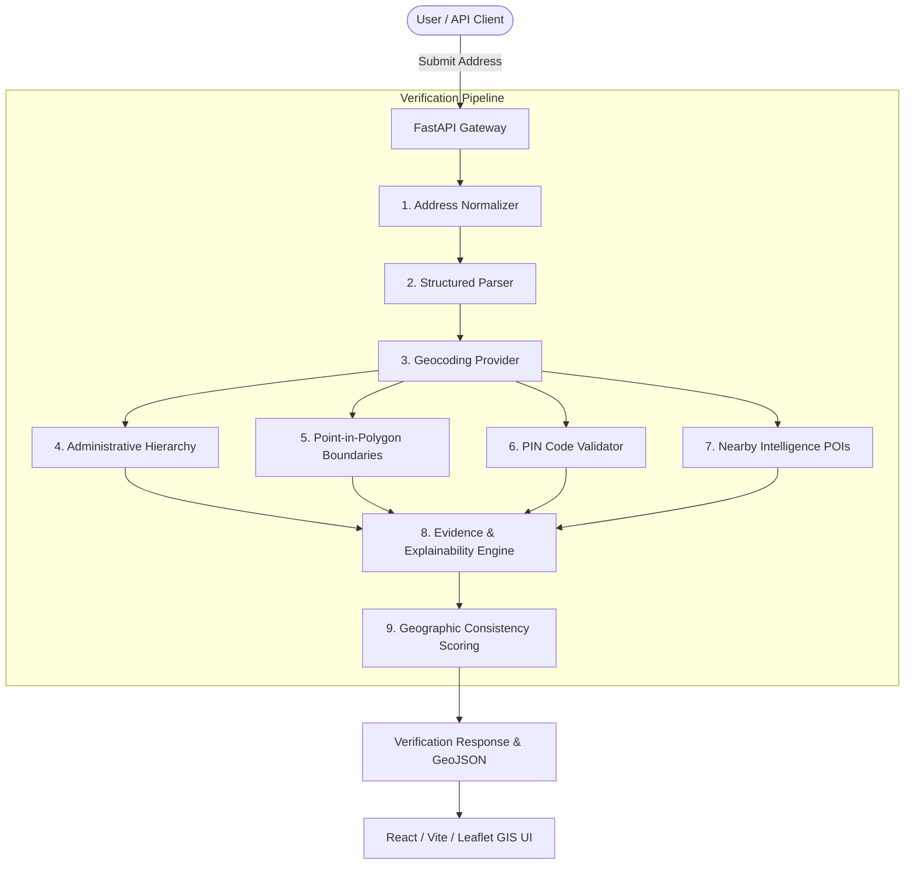

# GeoVerify India Architecture

## 1. System Overview

GeoVerify India is a multi-signal geospatial and administrative consistency verification platform designed specifically for the complexities of Indian addresses.

---

## 2. Component Architecture

### 2.1 Address Normalization Pipeline (`app/services/normalizer.py`)
- Standardizes capitalization, whitespace, and punctuation.
- Resolves abbreviations (e.g., `Rd` ➔ `Road`, `Bhd` ➔ `Behind`, `Sec` ➔ `Sector`).
- Normalizes state names, abbreviations, and common spelling variations (`MH` ➔ `Maharashtra`, `BLR` ➔ `Bengaluru Urban`).
- Formats 6-digit Indian PIN codes.
- Maintains a full `TransformationStep` audit trail.

### 2.2 Structured Parser (`app/services/address_parser.py`)
- Deconstructs free-form address strings into:
  - Premise / Building / Flat
  - Locality / Village
  - Sub-district / Taluka
  - District / City
  - State & State Code
  - PIN Code
  - Landmarks (`Near EON IT Park`)

### 2.3 Geocoding Provider Layer (`app/services/geocoder.py`)
- Abstract interface `GeocoderProvider`.
- `MockGeocoder`: High-fidelity offline reference dataset with fuzzy matching for development and testing.
- `NominatimGeocoder`: OpenStreetMap live geocoding provider with rate-limiting and fallback.
- In-memory caching layer.

### 2.4 Administrative Hierarchy Engine (`app/verification/hierarchy.py`)
- Enforces the Indian administrative structure:
  $$\text{Country} \rightarrow \text{State} \rightarrow \text{District} \rightarrow \text{Sub-District} \rightarrow \text{Locality}$$
- Detects administrative conflicts (e.g. `Kharadi` placed under `Kolhapur` instead of `Pune`).

### 2.5 Point-in-Polygon Boundary Verification (`app/verification/boundaries.py`)
- Uses Shapely geometries (`Polygon.contains(Point)`).
- Verifies geometric containment within state, district, and locality polygons.
- Emits GeoJSON FeatureCollection layers for Leaflet map rendering.

### 2.6 PIN Code Verification (`app/services/pin_validator.py`)
- Validates 6-digit PIN structure and postal circle prefix.
- Checks postal district and post office mappings.
- Computes Haversine distance between geocoded coordinates and the official PIN centroid.

### 2.7 Nearby Intelligence Service (`app/services/nearby.py`)
- Identifies contextual amenities (transit hubs, hospitals, police stations, IT parks, post offices) within a configurable radius (e.g., 5 km).
