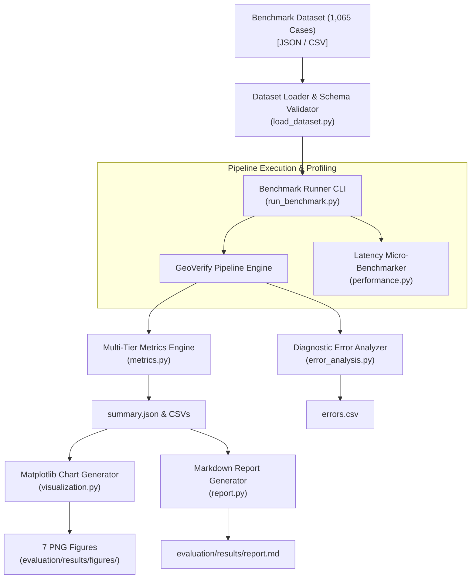

# Benchmark Methodology & Evaluation Framework (Phase 4)

## 1. Executive Summary

GeoVerify India Phase 4 establishes a standardized, reproducible, and mathematically rigorous benchmarking and evaluation framework. 

The evaluation framework is designed to measure:
1. **Multi-Tier Geographic Entity Resolution Accuracy**: Granular accuracy across State, District, Sub-District (Taluka/Tehsil), and Locality/Village levels, as well as exact end-to-end hierarchy alignment.
2. **Candidate Generation Retrieval Performance**: Evaluates candidate ranking effectiveness via $\text{Recall@}K$ ($K \in \{1, 3, 5, 10\}$).
3. **Homonymous Ambiguity Detection**: Diagnostic classification performance (Precision, Recall, F1) for multi-location name collisions across states and districts.
4. **Verification Status Classification Integrity**: Multi-class evaluation across 6 verification statuses (`VERIFIED`, `CONSISTENT`, `NEEDS_REVIEW`, `INCONSISTENT`, `AMBIGUOUS`, `UNABLE_TO_VERIFY`) with a $6 \times 6$ confusion matrix.
5. **System & Component Latency Profiles**: Micro-benchmarking pipeline components with empirical percentiles (Mean, Median, P50, P90, P95, P99).
6. **Diagnostic Error Categorization**: Automated categorization of pipeline failures into 12 structured diagnostic failure buckets.

---

## 2. Core Methodological Principles

### 2.1 Independent Ground Truth
Ground-truth annotations are stored in decoupled schema formats (`BenchmarkRecord` / `GroundTruth`) independent of internal prediction algorithms. Predictions are strictly generated by calling the production pipeline interfaces (`GeoVerifyEngine.verify_address` and `AddressEntityResolver.resolve_address`).

### 2.2 Privacy & Ethical Compliance (Zero PII)
No private personal addresses, individual resident names, phone numbers, or private building unit coordinates are used. All test records are synthetically constructed or derived from official public gazetteers under **GODL-India** (Local Government Directory and Department of Posts).

### 2.3 Comprehensive Real-World Complexity Slicing
Indian address realities are evaluated across:
- **Administrative Complexity**: Metro urban clusters, rural revenue villages, talukas/mandals/tehsils.
- **Linguistic Diversity**: Latin script, Devanagari Hindi, Devanagari Marathi, and code-mixed inputs.
- **Colloquial & Historical Aliases**: `Bombay` $\rightarrow$ `Mumbai`, `Poona` $\rightarrow$ `Pune`, `Calcutta` $\rightarrow$ `Kolkata`, `Bangalore` $\rightarrow$ `Bengaluru`.
- **Informal Formatting & Perturbations**: Syntactic token permutations, minor and severe character swaps/deletions, omitted administrative tiers.
- **Intentional Conflicts & Adversarial Inconsistencies**: Locality-district mismatches, swapped PIN codes, cross-state boundary anomalies.

---

## 3. Evaluation Architecture



---

## 4. Benchmark Categories (19 Distinct Cohorts)

The benchmark dataset generator (`evaluation/generate_dataset.py`) deterministically instantiates 1,065 test cases across 19 categories:

| Category | Description | Primary Evaluation Objective |
| :--- | :--- | :--- |
| `CORRECT_COMPLETE` | Fully specified addresses with all hierarchy tiers and correct PIN. | Baseline precision and high-confidence verification. |
| `CORRECT_MINIMAL` | Sparse inputs with only locality and state/district. | Robustness with missing intermediate tokens. |
| `PIN_MISMATCH` | Correct hierarchy with deliberately swapped out-of-circle PIN. | PIN boundary validation and `NEEDS_REVIEW` trigger. |
| `DISTRICT_MISMATCH` | Locality paired with an incorrect neighboring or distant district. | Administrative conflict detection and `INCONSISTENT` status. |
| `SUBDISTRICT_MISMATCH` | Locality placed in an incorrect subdistrict/taluka. | Sub-district hierarchy conflict resolution. |
| `AMBIGUOUS_NAME` | Homonymous localities (e.g., *Bilaspur*, *Rampur*) without state. | Ambiguity detection and disambiguation candidate list. |
| `COLLOQUIAL_ALIAS` | Local landmarks, business districts, and vernacular names. | Alias table matching and entity resolution. |
| `HISTORICAL_NAME` | Colonial and pre-reorganization city names (*Poona*, *Bombay*). | Historical alias mapping. |
| `DEVANAGARI_HINDI` | Addresses written fully in Devanagari Hindi script. | Indic script transliteration and Devanagari parsing. |
| `DEVANAGARI_MARATHI` | Addresses in Marathi script with regional prefixes (*गाव*, *तालुका*). | Marathi administrative prefix handling. |
| `MIXED_SCRIPT` | Devanagari locality with Latin city/PIN, or vice versa. | Cross-script tokenization and normalization. |
| `TYPO_MINOR` | 1-2 character edits (swaps, missing vowel, phonetic typo). | RapidFuzz similarity tolerance. |
| `TYPO_SEVERE` | 3+ character edits, heavy mangling. | Boundary between fuzzy recovery and unresolvable threshold. |
| `MISSING_PIN` | Complete hierarchy without PIN code. | Verification under missing postal signals. |
| `MISSING_DISTRICT` | Locality and State present, District omitted. | Upward administrative inference. |
| `MISSING_STATE` | Locality, District, and PIN present, State omitted. | PIN-to-state circle inference. |
| `RURAL_VILLAGE` | Revenue village, Gram Panchayat, Taluka structure. | Rural administrative depth. |
| `METRO_COMPLEX` | Tech parks, shopping complexes, ward numbers, arterial roads. | Complex urban hierarchy extraction. |
| `UNRESOLVABLE_NOISE` | Random gibberish, non-geographic noise, arbitrary strings. | Graceful rejection to `UNABLE_TO_VERIFY`. |

---

## 5. Execution Workflow

### 5.1 Full Benchmark Run
```powershell
$env:PYTHONPATH="backend;. "
python -m evaluation.run_benchmark --dataset evaluation/datasets/benchmark.json --output-dir evaluation/results
```

### 5.2 Fast Smoke Test (CI / Pre-commit)
```powershell
python -m evaluation.run_benchmark --smoke
```

### 5.3 Deterministic Dataset Regeneration
```powershell
python -m evaluation.generate_dataset --size 1050 --seed 42 --output evaluation/datasets/benchmark.json
```

---

## 6. Output Artifacts

Every benchmark execution outputs standardized, machine-readable, and visual artifacts:
1. `evaluation/results/summary.json`: Comprehensive machine-readable metrics, score statistics, confusion matrices, and latency percentiles.
2. `evaluation/results/metrics.csv`: Slice-by-slice metric table by benchmark category.
3. `evaluation/results/errors.csv`: Detailed log of every failed test case with assigned diagnostic failure bucket, ground truth, and actual predictions.
4. `evaluation/results/state_metrics.csv`: Geographic slice of resolution performance per Indian state.
5. `evaluation/results/confusion_matrix.csv`: $6 \times 6$ contingency matrix for verification statuses.
6. `evaluation/results/report.md`: Executive publication-ready Markdown report.
7. `evaluation/results/figures/*.png`: 7 high-resolution data visualization plots.
