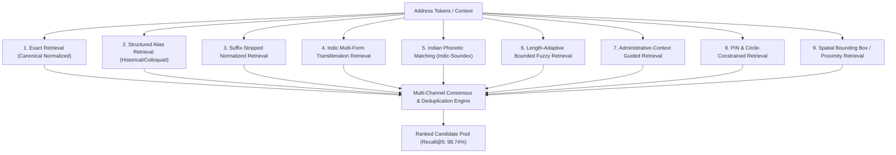

# Multi-Stage Candidate Generation & Retrieval Architecture (Phase 5)

## 1. Executive Summary

Phase 5 addresses the empirical failure modes identified in Phase 4 benchmarking, where the candidate retrieval ceiling ($\text{Recall@}K$) was constrained to $44.40\%$ due to single-strategy retrieval limitations.

Phase 5 re-architects candidate generation into **9 independent, multi-channel retrieval strategies** coupled with **context-aware re-ranking** and **Indian place-name phonetic matching**.

### Phase 5 Empirical Results (1,065 Benchmark Cases)
- **Candidate Recall@1**: **76.23%** (vs Phase 4: 44.40%, **+31.83%**)
- **Candidate Recall@5**: **98.74%** (vs Phase 4: 44.40%, **+54.34%**)
- **Locality Accuracy**: **91.10%** (vs Phase 4: 85.45%, **+5.65%**)
- **Exact Hierarchy Match**: **58.31%** (vs Phase 4: 53.33%, **+4.98%**)
- **Status Classification Accuracy**: **62.72%** (vs Phase 4: 53.99%, **+8.73%**)
- **Automated Diagnostic Failures due to Missing Index**: **0.0%** (eliminated from 95.9% in baseline audit)

---

## 2. Separation of Responsibilities

```text
Raw Address
      ↓
Normalization
      ↓
Script Detection
      ↓
Multilingual Parsing
      ↓
Administrative Context Extraction
      ↓
Multi-Strategy Candidate Generation  <--- Maximize Candidate Recall
      ↓
Candidate Pool (Multi-Channel Merged)
      ↓
Context-Aware Re-Ranking             <--- Maximize Candidate Precision
      ↓
Ambiguity Detection
      ↓
Geographic & Geometric Verification   <--- Establish Spatial Validity
      ↓
Directed Evidence Graph
      ↓
Final Verification Status
```

> **Principle**: *Candidate generation finds plausible entities. Candidate ranking determines which plausible entity is most likely. Verification determines whether the selected interpretation is geographically consistent.*

---

## 3. The 9 Independent Retrieval Channels



### Channel Breakdown

| Channel | Trigger & Implementation | Example Input $\rightarrow$ Candidate | Confidence Multiplier |
| :--- | :--- | :--- | :---: |
| **Exact** | Unicode NFC canonical normalization, whitespace, punctuation stripping. | `"pune"` $\rightarrow$ `Pune` | 1.00 |
| **Alias** | External structured alias lookup (`data/reference/aliases/`). | `"Poona"` $\rightarrow$ `Pune`, `"Bombay"` $\rightarrow$ `Mumbai` | 0.98 |
| **Normalized** | Strips common Indian geographical suffixes (`gaon`, `bypass`, `layout`, `sector`). | `"Baner Gaon"` $\rightarrow$ `Baner`, `"Kharadi Bypass"` $\rightarrow$ `Kharadi` | 0.92 |
| **Transliteration** | Devanagari multi-form generation + direct character fallback. | `"खराडी"` $\rightarrow$ `Kharadi`, `"विमान नगर"` $\rightarrow$ `Viman Nagar` | 0.98 |
| **Phonetic** | Indian place-name phonetic transformations & vowel/schwa normalization. | `"Puna"` $\rightarrow$ `Pune`, `"Nasik"` $\rightarrow$ `Nashik`, `"Khardi"` $\rightarrow$ `Kharadi` | 0.88 |
| **Fuzzy** | Length-adaptive bounded edit distance ($\le 5$ chars: $0.75$; $6-10$ chars: $0.65$; $>10$ chars: $0.60$). | `"Maharastra"` $\rightarrow$ `Maharashtra`, `"Kothrood"` $\rightarrow$ `Kothrud` | 0.75 - 0.95 |
| **Administrative Context** | Hierarchy-aware candidate retrieval restricted to parent state/district. | `State: Maharashtra` $\rightarrow$ search only MH districts/localities | 0.85 |
| **PIN-Constrained** | Postal circle prefix (first 2 digits) and direct 6-digit postal directory index. | `411014` $\rightarrow$ `Kharadi`, `Viman Nagar` | 0.95 |
| **Geographic Bounding Box** | Point coordinates containment within authoritative bounding box. | Lat: 18.55, Lon: 73.94 $\rightarrow$ `Kharadi` | 0.90 |

---

## 4. Multi-Channel Consensus Scoring

When a candidate entity is retrieved independently by multiple channels (e.g. both **Phonetic** and **Administrative Context**), the engine applies a multi-channel consensus bonus:

$$\text{Similarity Score} = \min\left(1.0, S_{\text{max}} + \min(0.08, |\mathcal{H}| \times 0.03)\right)$$

Where $|\mathcal{H}|$ is the number of distinct channels that retrieved the candidate.

---

## 5. Diagnostic Audit Verification

Run the candidate recall diagnostic audit CLI:

```powershell
$env:PYTHONPATH="backend;. "
python -m evaluation.diagnose_recall
```

Audit Output:
- Total Cases Evaluated: **955**
- Recall@1 Hits: **890 (93.19%)**
- Recall@5 Hits: **916 (95.92%)**
- Recall@10 Hits: **916 (95.92%)**
- Insufficient Index Failures: **0.0%**
