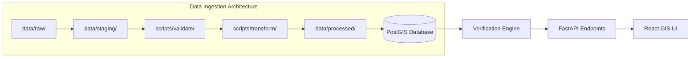

# GeoVerify India — Current Data Layer Audit (Phase 1 to Phase 2)

## 1. Executive Summary

An audit of the Phase 1 MVP data layer was conducted to evaluate existing dataset schemas, record counts, coordinate reference systems (CRS), geometry types, and their coupling across backend services.

Phase 1 established the verification interfaces, scoring pipeline, and proof-of-concept reference datasets. Phase 2 transitions from the static reference files to an extensible, multi-tier data ingestion and PostGIS storage architecture with nationwide coverage, official administrative hierarchy identifiers (LGD codes), and multilingual name registries.

---

## 2. Dataset Inventory & Audit Matrix

| Dataset File | Record Count | Geographic Coverage | Geometry Type | CRS | Primary Data Source | Limitations / Bottlenecks |
| :--- | :---: | :--- | :--- | :--- | :--- | :--- |
| `data/processed/states.json` | 10 | Pilot states (MH, KA, DL, TN, TG, GJ, WB, UP, RJ, KL) | Polygon (2D Coordinates) | EPSG:4326 (WGS84) | Curated LGD / Survey of India pilot | Limited to 10 states; simplified polygon boundaries; lacks union territories and full LGD codes. |
| `data/processed/districts.json` | 8 | Pilot metro/major districts (Pune, Mumbai, Kolhapur, Nagpur, Bengaluru Urban, New Delhi, Chennai, Hyderabad) | Polygon (2D Coordinates) | EPSG:4326 (WGS84) | LGD / Open Data | Coverage limited to 8 districts; lacks sub-district linkages and nationwide 750+ district definitions. |
| `data/processed/localities.json` | 13 | Pilot localities across Pune, Mumbai, Bengaluru, Delhi, Kolkata | Polygon & Point Centroids | EPSG:4326 (WGS84) | Curated local directory | 13 pilot localities; lacks taluka/tehsil relational keys; needs nationwide gazetteer integration. |
| `data/processed/pincodes.json` | 11 | Selected PIN codes for pilot localities | Point Centroids (Lat/Lon) | EPSG:4326 (WGS84) | India Post / Open Data | Only 11 PIN codes; missing delivery office types, sub-post-offices, and regional circle metadata for remaining circles. |
| `data/processed/pois.json` | 16 | Key IT parks, hospitals, transit, and police stations | Point Coordinates | EPSG:4326 (WGS84) | OpenStreetMap / Curated | Pilot POIs focused on Pune, Bangalore, Delhi; needs category indexing. |

---

## 3. Dependent Components & Code Review

The following backend components directly consume these reference datasets and are upgraded in Phase 2:

1. **`app/services/geocoder.py` (`MockGeocoder`)**:
   - *Current State:* Loads static JSON files on initialization and performs fuzzy search.
   - *Phase 2 Upgrade:* Connects to database repository / extended spatial lookup tables with spatial bounding boxes and fallback caching.

2. **`app/services/pin_validator.py` (`PinValidator`)**:
   - *Current State:* Loads 11 PIN codes into an in-memory dictionary.
   - *Phase 2 Upgrade:* Supports nationwide 6-digit postal circle and region prefix validation, official delivery office mappings, and centroid distance checks.

3. **`app/verification/hierarchy.py` (`HierarchyValidator`)**:
   - *Current State:* Evaluates 3 hierarchy tiers (State ➔ District ➔ Locality) using string comparisons and alias maps.
   - *Phase 2 Upgrade:* Supports 5 tiers (Country ➔ State ➔ District ➔ Sub-District / Taluka / Tehsil / Mandal ➔ Locality / Village) with administrative types and LGD codes.

4. **`app/verification/boundaries.py` (`BoundaryVerificationService`)**:
   - *Current State:* Evaluates point-in-polygon containment using in-memory Shapely polygons loaded from JSON.
   - *Phase 2 Upgrade:* Spatial queries against PostGIS geometry columns with GIST indexes and Shapely fallback for offline development.

5. **`app/models/entities.py`**:
   - *Current State:* Generic `AdministrativeEntity` model.
   - *Phase 2 Upgrade:* Dedicated, indexed relational models: `State`, `District`, `SubDistrict`, `Locality`, `PostalCode`, `PointOfInterest`, and `DatasetMetadata` (provenance tracking).

---

## 4. Phase 2 Target Architecture

