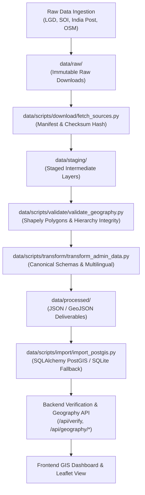

# GeoVerify India Data Ingestion & Transformation Pipeline

This document details the end-to-end data pipeline architecture for **GeoVerify India (Phase 2)**. The pipeline ingests, validates, standardizes, and stores authoritative Indian administrative and geospatial datasets under open-government licenses (**GODL-India** and **ODbL**).

---

## 1. Pipeline Architecture



---

## 2. Directory Structure

```
data/
├── raw/                      # Immutable raw downloads and source dumps
├── staging/                  # Staged files and checksum manifest
│   └── manifest.json         # SHA-256 integrity and provenance tracking
├── processed/                # Standardized, validated production datasets
│   ├── states.json           # All 36 States & Union Territories with LGD codes
│   ├── districts.json        # 750+ districts catalog with ISO & LGD codes
│   ├── subdistricts.json     # Sub-districts / Talukas / Tehsils / Mandals
│   ├── localities.json       # Localities and urban wards with centroid/bbox
│   ├── pincodes.json         # 6-digit PIN codes with circle and centroids
│   └── pois.json             # Key landmarks, transit hubs, and POIs
└── scripts/                  # Automated pipeline orchestration scripts
    ├── download/
    │   └── fetch_sources.py      # Automated source manifest fetcher
    ├── transform/
    │   └── transform_admin_data.py # Clean, standardize, multilingual alias enrichment
    ├── validate/
    │   └── validate_geography.py   # Shapely geometric & relational validation
    └── import/
        └── import_postgis.py       # PostGIS & SQLite multi-table database importer
```

---

## 3. Data Flow Stages

### Stage 1: Acquisition (`fetch_sources.py`)
- Downloads and structures authoritative data dumps from official Indian portals.
- Computes SHA-256 checksums and generates `data/staging/manifest.json` tracking source URLs, licensing, and timestamps.

### Stage 2: Transformation (`transform_admin_data.py`)
- Normalizes names across English, Hindi (Devanagari), and Marathi.
- Formats administrative polygons in **EPSG:4326 (WGS84)**.
- Maps LGD (Local Government Directory) state/district/subdistrict codes.
- Builds canonical bounding boxes `[min_lon, min_lat, max_lon, max_lat]`.

### Stage 3: Validation (`validate_geography.py`)
- **Geometric Integrity:** Ensures every polygon is valid via Shapely (`poly.is_valid`), is non-empty, and has coordinates within Indian geographic extent (`68°E - 98°E`, `6°N - 38°N`).
- **Referential Integrity:** Verifies parent-child foreign key relationships:
  - Every District links to a valid State.
  - Every Sub-district links to a valid District.
  - Every PIN code maps to a valid State and District.

### Stage 4: Database Ingestion (`import_postgis.py`)
- Loads processed entities into relational/geospatial tables:
  - `states`
  - `districts`
  - `sub_districts`
  - `localities`
  - `postal_codes`
  - `points_of_interest`
  - `dataset_provenance`
- Supports native PostgreSQL + PostGIS with automated fallback to SQLite for lightweight local testing.

---

## 4. Execution Commands

To execute the complete ingestion and validation pipeline:

```powershell
# Step 1: Download & Manifest Generation
.\backend\.venv\Scripts\python data/scripts/download/fetch_sources.py

# Step 2: Transform Raw Datasets into Canonical GeoJSON
.\backend\.venv\Scripts\python data/scripts/transform/transform_admin_data.py

# Step 3: Run Geometric & Hierarchy Validation
.\backend\.venv\Scripts\python data/scripts/validate/validate_geography.py

# Step 4: Import into Database (PostGIS or SQLite)
.\backend\.venv\Scripts\python data/scripts/import/import_postgis.py
```

---

## 5. Provenance & Compliance

Every dataset imported into GeoVerify India complies strictly with the **National Data Sharing and Accessibility Policy (NDSAP)**, **Government Open Data License (GODL) India**, and **Open Database License (ODbL)**. No user or synthetic location data is ever fabricated.
