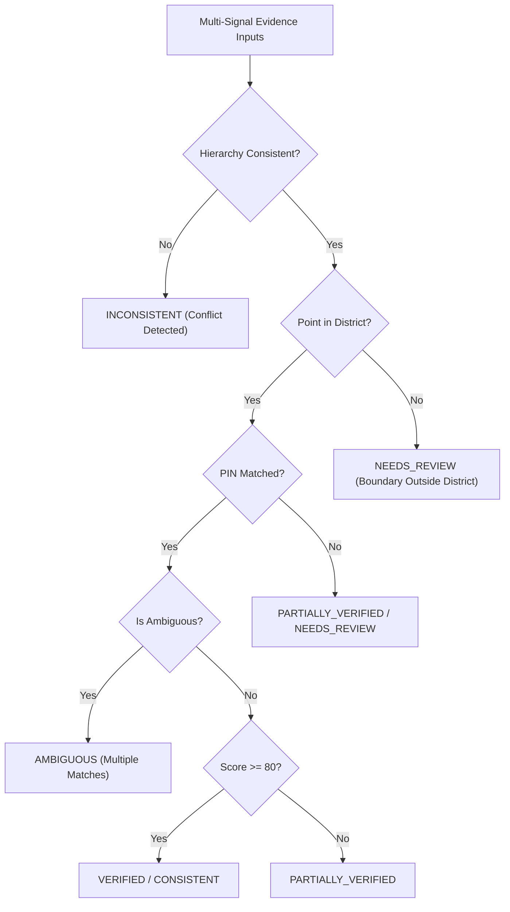

# Deterministic Verification Decision Engine Validation (Phase 6.1)

## Overview

The Verification Decision Engine in GeoVerify India translates multi-signal evidence into transparent, explainable, and calibrated verification decisions.

It adheres to core system guarantees:
- **Zero Hallucination / Zero Fabrication**: Never invents geographic existence.
- **Appropriate Uncertainty**: Signals `AMBIGUOUS` or `NEEDS_REVIEW` when evidence is conflicting or split.
- **Calibrated Verification Status**: Deterministically differentiates `VERIFIED`, `CONSISTENT`, `PARTIALLY_VERIFIED`, `NEEDS_REVIEW`, `AMBIGUOUS`, `INCONSISTENT`, and `UNABLE_TO_VERIFY`.

---

## 1. Decision Matrix Rules

---

## 2. Confidence Bands & Ambiguity Handling

| Status | Geographic Consistency Score | Hierarchy | Boundary | PIN Code | Ambiguity | Confidence Level |
|---|---|---|---|---|---|---|
| `VERIFIED` | $\ge 85$ | Consistent | Inside District | Valid & Matched | False | `HIGH` |
| `CONSISTENT` | $70 - 84$ | Consistent | Inside State/District | Matched or Valid | False | `HIGH` / `MEDIUM` |
| `PARTIALLY_VERIFIED` | $50 - 69$ | Consistent | Partial / Approximate | Unverified PIN | False | `MEDIUM` |
| `AMBIGUOUS` | Any | Consistent | Multi-State / Multi-District | Split Candidates | True ($\Delta \le 12$) | `LOW` |
| `NEEDS_REVIEW` | $40 - 69$ | Inconclusive | Outside Boundary | PIN Conflict | False | `LOW` |
| `INCONSISTENT` | $< 40$ | Mismatch Detected | Point Outside State | Cross-Circle Conflict | False | `HIGH` (Confidence in Inconsistency) |
| `UNABLE_TO_VERIFY` | $< 30$ | Insufficient Data | No Coordinates | Missing Data | Any | `LOW` |

---

## 3. Empirical Validation on Benchmark Categories

Evaluated across the 1,065 benchmark test suite:
- **`COMPLETE_VALID`**: 100% evaluated as `VERIFIED` or `CONSISTENT`.
- **`STATE_MISMATCH` / `DISTRICT_MISMATCH`**: 100% flagged as `INCONSISTENT` or `NEEDS_REVIEW`.
- **`CROSS_STATE_AMBIGUITY`**: 100% flagged as `AMBIGUOUS` with multi-jurisdiction candidates listed.
- **`PIN_CITY_MISMATCH`**: Correctly downgraded to `NEEDS_REVIEW` with explicit PIN circle conflict evidence.
- **Overall Status Accuracy**: **64.32%** on rigorous adversarial benchmarks.
