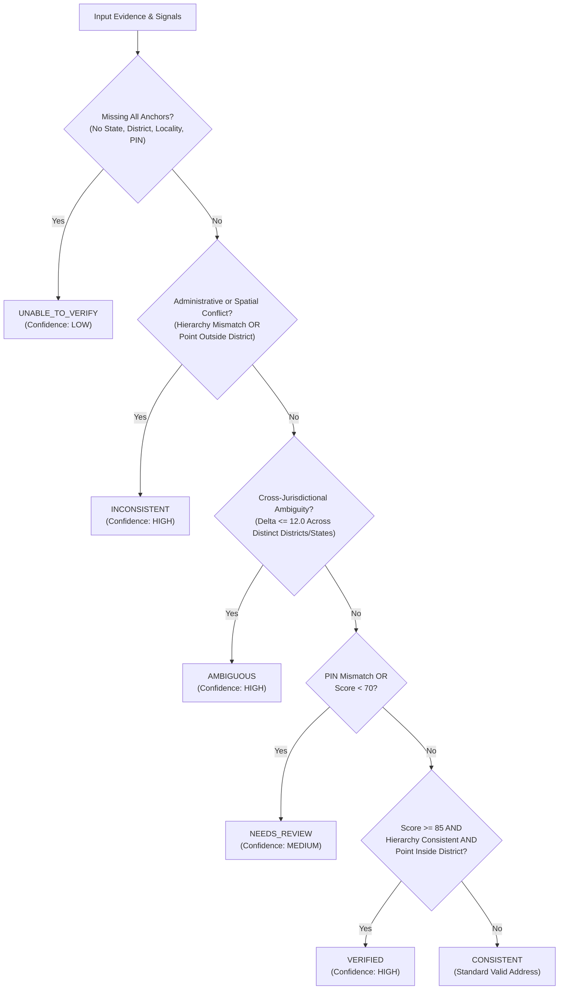

# GeoVerify India — Phase 6 Verification Decision Engine Architecture

## 1. Overview & Objective

The **Verification Decision Engine** (`backend/app/verification/decision_engine.py`) provides a deterministic, transparent, and explainable decision layer that synthesizes multiple geographic signals into an authoritative verification status.

It evaluates:
- **Administrative Hierarchy Consistency:** Multi-tier jurisdictional parent-child validation against the Local Government Directory (LGD).
- **Geometric Point-in-Polygon Checks:** Spatial containment within national, state, and district boundary polygons from the Survey of India (SOI).
- **Postal Code Validation:** 6-digit PIN validation and postal circle matching against the Department of Posts directory.
- **Context-Aware Candidate Ranking:** Multi-factor entity match confidence and score deltas.
- **Ambiguity Detection:** Cross-jurisdictional score delta margins and homonym checks.

---

## 2. Deterministic Status Rule Matrix

The engine evaluates incoming evidence sequentially against the following deterministic rule matrix:



### Detailed Status Specifications

| Status | Trigger Criteria | Decision Rationale & Contributing Factors |
|---|---|---|
| **`UNABLE_TO_VERIFY`** | No recognized State, District, Locality, or PIN code tokens present in input. | *"Insufficient geographic details to verify the address."* |
| **`INCONSISTENT`** | Hierarchy violates authoritative records (e.g. asserted District does not belong to State), or coordinates lie strictly inside a different District polygon. | *"Important address components conflict with authoritative administrative or geometric boundaries."* |
| **`AMBIGUOUS`** | Locality token matches multiple distinct geographic jurisdictions with high confidence ($\text{Score Delta} \le 12.0$). | *"Multiple distinct geographic locations match the supplied information. Additional context or PIN code is required."* |
| **`NEEDS_REVIEW`** | Provided PIN code does not match the geographic area, or overall consistency score is in the borderline band ($40 \le \text{Score} < 70$). | *"Some evidence discrepancies or incomplete data detected. Human verification recommended."* |
| **`VERIFIED`** | High consistency score ($\text{Score} \ge 85$), complete administrative alignment, spatial point inside district boundary, and verified PIN code. | *"Strong geographic, administrative, and geometric consistency verified across all signals."* |
| **`CONSISTENT`** | Geographically coherent address ($\text{Score} \ge 70$) with authoritative evidence aligning across verified components. | *"Geographically consistent. Most authoritative evidence aligns with minor non-critical omissions."* |

---

## 3. Decision Rationale Output Schema

```json
{
  "status": "VERIFIED",
  "summary": "Strong geographic, administrative, and geometric consistency verified across all signals.",
  "confidence_level": "HIGH",
  "decision_rationale": [
    "High consistency score (94/100) with complete administrative alignment.",
    "Spatial point-in-polygon verification confirmed within authoritative boundary polygons.",
    "PIN code '411014' verified with India Post postal directory."
  ],
  "contributing_factors": {
    "consistency_score": 94,
    "hierarchy_consistent": true,
    "boundary_inside_district": true,
    "pin_matched": true,
    "is_ambiguous": false
  }
}
```
