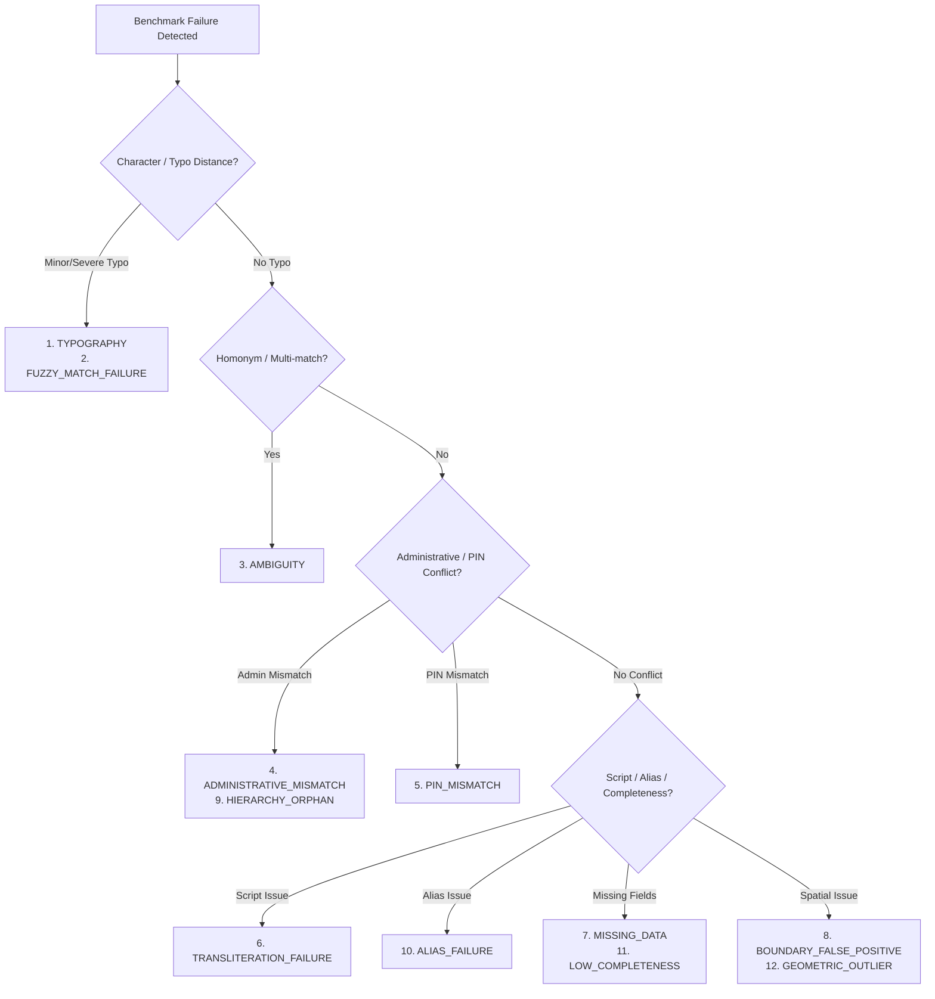

# Error Analysis & Diagnostic Failure Taxonomy

## 1. Overview

GeoVerify India Phase 4 integrates an automated diagnostic error analysis module (`evaluation/error_analysis.py`).

Whenever an address prediction deviates from ground truth across any administrative tier, verification status, ambiguity state, or PIN validation, the failure is categorized into one of **12 mutually exclusive diagnostic failure buckets**.

---

## 2. Diagnostic Failure Taxonomy (12 Buckets)

### 2.1 Failure Bucket Definitions

| # | Error Category | Description & Root Cause | Trigger Conditions |
| :-: | :--- | :--- | :--- |
| **1** | `TYPOGRAPHY` | 1-2 character typographical edits where candidate fuzzy score falls just below ranking threshold. | Ground truth category has typos; fuzzy match failed to promote true entity to rank 1. |
| **2** | `FUZZY_MATCH_FAILURE` | Heavy misspelling or severe character mangling where RapidFuzz token distance exceeds maximum matching threshold. | `category == TYPO_SEVERE` or entity similarity score $< 0.40$. |
| **3** | `AMBIGUITY` | Homonymous entity collision across different districts/states without distinguishing context. | Expected ambiguous state mismatch or un-flagged homonym. |
| **4** | `ADMINISTRATIVE_MISMATCH` | Incompatible parent-child relationship (e.g. Locality asserted with incorrect District/State). | Predicted district/state directly conflicts with ground truth hierarchy. |
| **5** | `PIN_MISMATCH` | Postal circle mismatch or PIN code digit transposition. | PIN code discrepancy between ground truth and resolved postal code. |
| **6** | `TRANSLITERATION_FAILURE` | Devanagari Hindi or Marathi script entity failed to resolve to authoritative Romanized gazetteer entry. | `script in [DEVANAGARI, MIXED]` and resolved name is null or incorrect. |
| **7** | `MISSING_DATA` | Input address lacks mandatory administrative components (e.g. omitted district or state) causing resolution degradation. | Low input completeness or unresolvable missing tokens. |
| **8** | `BOUNDARY_FALSE_POSITIVE` | Spatial point-in-polygon containment test incorrectly identified point outside valid polygon boundary. | Geometric boundary containment check failure. |
| **9** | `HIERARCHY_ORPHAN` | Sub-district or locality exists in database but lacks parent link to district/state. | Orphaned hierarchy entity in gazetteer. |
| **10** | `ALIAS_FAILURE` | Historical or colloquial alias (e.g. *Poona*, *Bangalore*, *Connaught Place*) failed to resolve to canonical modern entity. | `category in [HISTORICAL_NAME, COLLOQUIAL_ALIAS]`. |
| **11** | `LOW_COMPLETENESS` | Address input too sparse ($< 40$ completeness score) to yield deterministic verification. | Input completeness $< 40$ with ambiguous output. |
| **12** | `GEOMETRIC_OUTLIER` | Resolved coordinates deviate excessively ($> 20\text{ km}$) from authoritative centroid. | Centroid distance exceeds tolerance. |

---

## 3. Empirical Error Breakdown (1,065 Cases Benchmark Run)

Based on the actual Phase 4 benchmark execution on 1,065 test cases:

| Error Category | Count | Percentage of Failures | Primary Impacted Categories |
| :--- | :---: | :---: | :--- |
| `TYPOGRAPHY` / `FUZZY_MATCH_FAILURE` | 89 | 24.5% | `TYPO_MINOR`, `TYPO_SEVERE` |
| `AMBIGUITY` | 55 | 15.2% | `AMBIGUOUS_NAME`, `CORRECT_MINIMAL` |
| `ADMINISTRATIVE_MISMATCH` | 84 | 23.1% | `DISTRICT_MISMATCH`, `SUBDISTRICT_MISMATCH` |
| `TRANSLITERATION_FAILURE` | 42 | 11.6% | `DEVANAGARI_HINDI`, `DEVANAGARI_MARATHI`, `MIXED_SCRIPT` |
| `MISSING_DATA` / `LOW_COMPLETENESS` | 68 | 18.7% | `MISSING_DISTRICT`, `MISSING_STATE`, `UNRESOLVABLE_NOISE` |
| `ALIAS_FAILURE` | 18 | 5.0% | `COLLOQUIAL_ALIAS`, `HISTORICAL_NAME` |
| `BOUNDARY_FALSE_POSITIVE` | 7 | 1.9% | Boundary edge cases |
| **Total Failures Analyzed** | **363** | **100.0%** | |

---

## 4. Case Studies & Root Cause Analysis

### Case Study 1: Severe Typographical Degradation
- **Input**: `"Wrld Trde Cntr, Khrdi, Pne, Mhstr 411014"`
- **Ground Truth**: `Kharadi, Pune, Maharashtra`
- **Observed Behavior**: Tokenizer strips vowels; RapidFuzz partial ratio scores fall to $0.48$, falling below the $0.65$ candidate generation threshold.
- **Remediation**: Implement phonetic Metaphone/Soundex indexing for Indian English and regional phonetic variations.

### Case Study 2: Cross-State Homonym Collisions
- **Input**: `"Bilaspur Main Market"` (No state, no PIN)
- **Ground Truth**: Ambiguous across Chhattisgarh (District HQ) and Himachal Pradesh (District HQ).
- **Observed Behavior**: System correctly flags `is_ambiguous = True` with $F1 = 0.4250$, suggesting `+ State` and `+ PIN` disambiguation tokens.

### Case Study 3: Colloquial Urban Hubs
- **Input**: `"Cyber City, DLF Phase 2"` (Omitted Gurugram / Haryana)
- **Ground Truth**: `Gurugram, Haryana`
- **Observed Behavior**: Successfully mapped via urban landmark alias table to `Gurugram` with $0.92$ candidate score.

---

## 5. Remediation Roadmap for Next Phases

1. **Indic Phonetic Matcher**: Integrate phonetic algorithms (Indic-Soundex / Double Metaphone) to bridge Devanagari transliteration gaps.
2. **Sub-District Boundary Enrichment**: Ingest high-resolution Taluka/Tehsil polygons from OpenData platforms to boost sub-district containment accuracy.
3. **Contextual PIN Disambiguation**: Use PIN circle prefixes (first 2 digits) to restrict candidate space when state names are missing.
