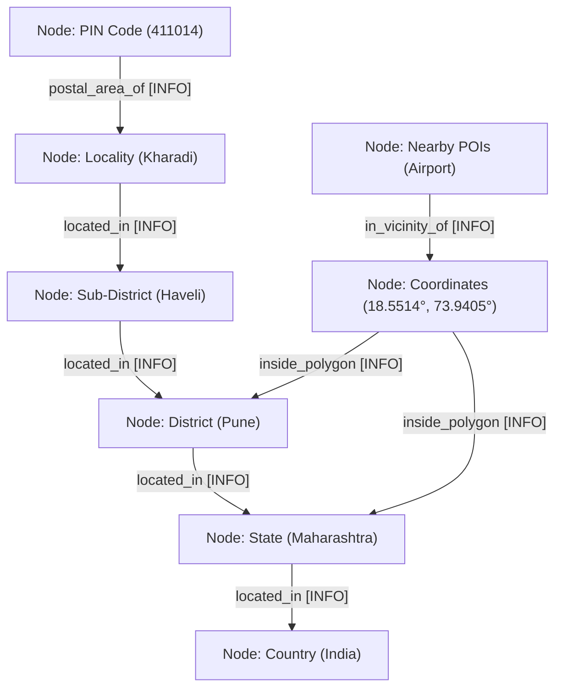
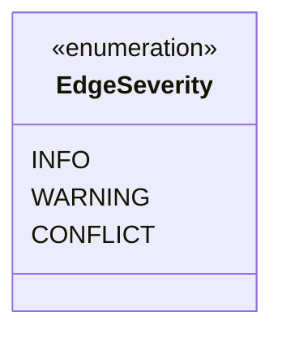

# Directed Evidence Graph Model

## 1. Overview

GeoVerify India structures address verification results as a **Directed Evidence Graph**. Instead of a monolithic black-box score, every assertion and cross-level geographic relationship is represented as an explicit graph node and edge with typed semantics and severity classifications.



---

## 2. Graph Node Types

Each node represents a distinct geographic or administrative entity:

| Node Type | Level Label | Properties |
| :--- | :--- | :--- |
| `country` | Country | Name, Sovereign nation status |
| `state` | State / Union Territory | Canonical name, ISO/LGD code, Polygon geometry |
| `district` | District | Canonical name, State parent, District polygon |
| `subdistrict` | Sub-District / Taluka / Tehsil | Canonical name, District parent |
| `locality` | Locality / Village / Town | Canonical name, Locality bounding box / point |
| `pincode` | Postal Index Code | 6-digit PIN, Postal Circle, Distance centroid |
| `coordinates` | Spatial Point | WGS84 Latitude & Longitude |
| `landmark` | Landmark | Name, Category, Proximity distance |

### Node Statuses:
* `VERIFIED`: Consistent and confirmed against registry.
* `WARNING`: Partial discrepancy, missing parent, or non-critical distance offset.
* `CONFLICT`: Authoritative conflict or boundary mismatch.
* `UNVERIFIED`: Insufficient context to verify.

---

## 3. Relationship Types & Edge Semantics

Edges represent directional semantic dependencies between nodes:

| Relationship Type | Description | Example |
| :--- | :--- | :--- |
| `located_in` | Administrative containment | `Kharadi` $\rightarrow$ `Haveli` |
| `inside_polygon` | Spatial point-in-polygon containment | `(18.55°, 73.94°)` $\rightarrow$ `Pune District Polygon` |
| `postal_area_of` | India Post coverage area | `411014` $\rightarrow$ `Kharadi` |
| `in_vicinity_of` | Proximity / POI neighborhood | `Pune Airport` $\rightarrow$ `Coordinates` |
| `administrative_parent` | High-level administrative hierarchy link | `Maharashtra` $\rightarrow$ `India` |
| `mismatch_with` | Authoritative hierarchical conflict | `Kolhapur` $\rightarrow$ `Kharadi` |

---

## 4. Edge Severity Classifications

Edges are annotated with explicit severity levels that explain verification conclusions:



* **`INFO` (Green):**
  The relationship is administratively, geometrically, and postally consistent.
  *Example:* Locality `Kharadi` is confirmed within `Haveli` sub-district and `Pune` district.

* **`WARNING` (Amber):**
  Minor or non-critical discrepancy that does not invalidate the address but requires attention.
  *Example:* PIN code centroid is $> 15\text{ km}$ from the geocoded address, or sub-district boundary is unavailable.

* **`CONFLICT` (Red):**
  Direct contradiction with authoritative administrative boundaries or government registries.
  *Example:* Address asserts locality `Whitefield` (Bengaluru) inside `Mysuru` district, or geocoded coordinates fall outside the asserted state polygon.

---

## 5. Graph Serialization Formats

The evidence graph can be retrieved in multiple standard formats:

### 1. GeoVerify Standard JSON (`/api/evidence/{verification_id}`)
```json
{
  "nodes": [
    {
      "id": "loc_kharadi",
      "label": "Kharadi",
      "node_type": "locality",
      "level": "Locality",
      "status": "VERIFIED",
      "properties": {}
    }
  ],
  "relationships": [
    {
      "id": "edge_loc_kharadi_dist_pune",
      "source": "loc_kharadi",
      "target": "dist_pune",
      "relationship": "located_in",
      "label": "located in",
      "severity": "INFO",
      "passed": true,
      "evidence_text": "Locality 'Kharadi' within administrative division"
    }
  ],
  "summary": "Administrative hierarchy is fully consistent.",
  "conflicts_count": 0,
  "warnings_count": 0
}
```

### 2. Cytoscape.js Format (`evidence_serializer.to_cytoscape(graph)`)
Provides `{ elements: [ { group: "nodes", data: {...} }, { group: "edges", data: {...} } ] }` for direct rendering in web graph libraries like Cytoscape, D3.js, or Vis.js.
