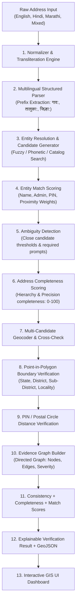

# Phase 3 Implementation Plan: Address Intelligence & Explainable Verification

## 1. Executive Summary & Objective

Phase 3 transitions **GeoVerify India** from an address consistency checker into an **AI-assisted Indian address intelligence and explainable geographic verification platform**. 

Geographic verification remains **strictly evidence-based and deterministic** (using Shapely point-in-polygon containment, LGD hierarchies, and India Post directories). AI/ML and heuristic intelligence assist in structured candidate extraction, transliteration, and ambiguity detection without replacing GIS ground truth.

---

## 2. Repository & Architectural Audit

### 2.1 Existing Components (Baseline)
- **FastAPI Core (`backend/app/main.py`)**: Asynchronous REST API with CORS and modular routers (`health`, `addresses`, `verification`, `nearby`, `geography`).
- **Data Ingestion Pipeline (`data/scripts/`)**: Ingests authoritative datasets (LGD, SOI, India Post, OSM) into `data/processed/` JSON/GeoJSON catalogs and PostGIS tables.
- **Normalizer (`backend/app/services/normalizer.py`)**: Normalizes whitespace, abbreviations, Devanagari state names (`महाराष्ट्र`, `कर्नाटक`, `दिल्ली`), and district aliases.
- **Address Parser (`backend/app/services/address_parser.py`)**: Structured rule-based parsing for premise, landmarks, locality, taluka/subdistrict, district, state, and PIN.
- **Geocoder Service (`backend/app/services/geocoder.py`)**: Provider abstraction supporting mock catalog and Nominatim geocoder.
- **Verification Engine (`backend/app/verification/`)**:
  - `boundaries.py`: Shapely point-in-polygon containment.
  - `hierarchy.py`: 5-tier administrative hierarchy.
  - `pin_validator.py`: Separated postal format, circle, and centroid distance checks.
  - `scoring.py`: Geographic Consistency Score (0-100).
- **Frontend (`frontend/src/`)**: React 18, TypeScript, Tailwind CSS, Leaflet GIS map, and score display.
- **Test Suite**: 52/52 passing backend tests.

---

## 3. Phase 3 Architecture: Target Pipeline

---

## 4. Components Being Extended

1. **`app/schemas/verification.py` & `app/schemas/address.py`**:
   - Add `AddressScores` (`geographic_consistency`, `address_completeness`, `entity_match`).
   - Add `CandidateEntity`, `AmbiguityDetails`, `EvidenceGraphResponse`, `EvidenceSeverity` (`INFO`, `WARNING`, `CONFLICT`).
2. **`app/services/normalizer.py` & `app/services/address_parser.py`**:
   - Add Devanagari prefix parsing (`गाव:`, `तालुका:`, `जिल्हा:`, `राज्य:`, `पिन:`).
   - Support mixed-language addresses (`Kharadi, पुणे, Maharashtra 411014`).
3. **`app/services/geocoder.py`**:
   - Multi-candidate geocoding responses, bounding box metadata, and provider confidence.
4. **`app/verification/scoring.py`**:
   - Integrate `AddressCompletenessScorer` and `EntityMatchScorer`.
5. **`app/verification/engine.py`**:
   - Full orchestration connecting entity resolution, candidate ranking, ambiguity checks, completeness scoring, and evidence graph construction.

---

## 5. New Components

### 5.1 Address Entity Resolution (`backend/app/entity_resolution/`)
- `__init__.py`: Package export.
- `models.py`: Pydantic models for candidates, match scores, entity types, and ambiguity containers.
- `candidates.py`: Multi-source candidate generator with RapidFuzz and Indic phonetic matching across states, districts, sub-districts, localities, PINs, and POIs.
- `matcher.py`: Transparent 5-part Entity Match Score:
  - Name similarity (40%)
  - Administrative context (25%)
  - PIN compatibility (15%)
  - Geographic proximity (15%)
  - Entity type match (5%)
- `resolver.py`: Orchestrates end-to-end token resolution into ranked candidate hierarchies.
- `ambiguity.py`: Detects multi-match ambiguities (e.g. `Rampur` in UP vs Bihar vs MP) and generates required disambiguation prompts.

### 5.2 Transliteration Service (`backend/app/services/transliteration.py`)
- Bi-directional Indic transliteration and phonetic normalization (Hindi/Marathi Devanagari $\leftrightarrow$ English Latin).

### 5.3 Evidence Graph Architecture (`backend/app/evidence/`)
- `nodes.py`: Node definitions (`CountryNode`, `StateNode`, `DistrictNode`, `SubDistrictNode`, `LocalityNode`, `PinNode`, `CoordinateNode`, `PoiNode`).
- `relationships.py`: Directed edge types (`located_in`, `inside_polygon`, `postal_area_of`, `in_vicinity_of`, `administrative_parent`).
- `graph.py`: EvidenceGraph builder recording verification facts and cross-checks.
- `serializer.py`: Graph serialization to Cytoscape/D3/JSON format for API and UI rendering.

### 5.4 API Routes (`backend/app/api/routes/address_intelligence.py` & `evidence_routes.py`)
- `POST /api/address/resolve`: Direct entity resolution with candidate ranking.
- `GET /api/address/candidates`: Search candidates for an arbitrary query token.
- `POST /api/address/ambiguity`: Test address ambiguity with thresholding.
- `POST /api/address/completeness`: Calculate Address Completeness Score.
- `GET /api/evidence/{verification_id}`: Fetch full structured evidence graph.

---

## 6. Frontend Extensions (`frontend/src/`)

1. **Multi-Score Display**:
   - Geographic Consistency Score ($0-100$)
   - Address Completeness Score ($0-100$)
   - Entity Match Score ($0-100$)
2. **Address Interpretation Box**:
   - Displays parsed and resolved components with detected language/script.
3. **Ambiguity Resolution Component**:
   - Clear warning card when multiple candidate matches exist with required disambiguation fields.
4. **Interactive Evidence Graph / Visual Hierarchy**:
   - Color-coded severity badges (`INFO` = blue/slate, `WARNING` = amber, `CONFLICT` = rose).
5. **Interactive Layer Toggles in Leaflet Map**:
   - Checkboxes for State, District, Sub-District, Locality boundaries, and POIs.
6. **Enhanced 3-Stage Transformation Viewer**:
   - Input $\rightarrow$ Normalized $\rightarrow$ Resolved.

---

## 7. Testing Strategy

1. **Baseline Invariance**: All 52 existing Phase 1 & 2 tests must remain 100% green.
2. **Benchmark Dataset (`tests/fixtures/address_benchmark.json`)**:
   - Comprehensive test cases covering: `VALID`, `TYPO`, `MULTILINGUAL`, `MIXED_LANGUAGE`, `AMBIGUOUS`, `DISTRICT_MISMATCH`, `STATE_MISMATCH`, `PIN_MISMATCH`, `INCOMPLETE`.
3. **Phase 3 Test Suites (`backend/tests/`)**:
   - `test_phase3_entity_resolution.py`: Candidate generation, RapidFuzz match scores, transliteration.
   - `test_phase3_ambiguity_completeness.py`: Ambiguity detection, completeness score weights, disambiguation prompts.
   - `test_phase3_evidence_graph.py`: Graph nodes, directed edges, severity classifications (`INFO`, `WARNING`, `CONFLICT`).
   - `test_phase3_multilingual_parser.py`: Indic prefixes (`गाव:`, `तालुका:`, `जिल्हा:`), mixed-language addresses.
4. **Target**: **80+ robust passing tests**.
