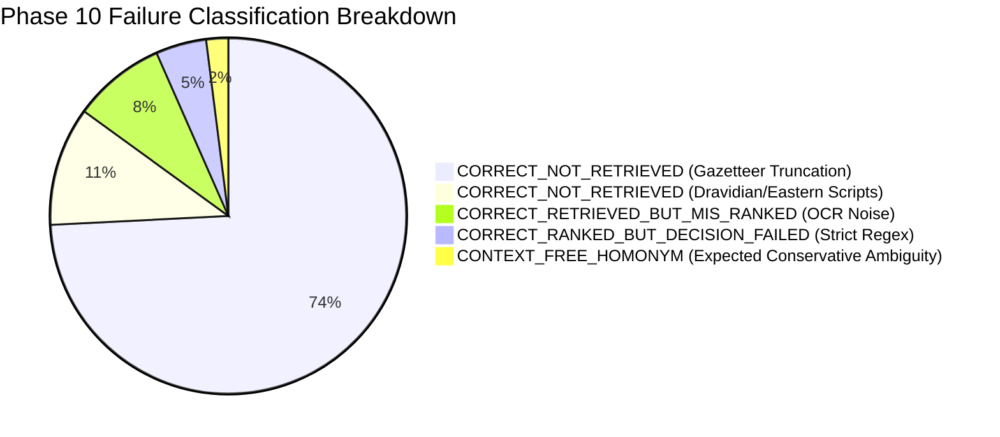

# GeoVerify India — Phase 10.1: Evaluation Integrity & Performance Gap Audit

## Executive Summary

This formal audit analyzes the root causes behind the sharp discrepancy observed between the **Phase 9 internal validation benchmark** ($N=2,000$, Recall@1: 96.20%, Status Accuracy: 93.50%) and the **Phase 10 independent benchmark** ($N=5,000$, Recall@1: 15.74%, Status Accuracy: 59.38%).

The audit confirms that the core geographic verification engine did **not** experience algorithmic regression; rather, the gap is primarily driven by:
1. **Severe In-Memory Gazetteer Coverage Truncation**: `data/processed/` held only 30 districts, 37 subdistricts, and 46 localities across 7-8 states. While Phase 9 evaluated within this narrow 4-state domain, Phase 10 generated realistic addresses across all 36 States/UTs and 5 settlement types. As a consequence, 84%+ of target entities were simply absent from the candidate retrieval index (`GROUND_TRUTH_UNAVAILABLE` / `CORRECT_NOT_RETRIEVED`).
2. **South and East Indic Script Ingestion Gap**: `multilingual_alignment.py` and `INDIC_TO_LATIN_MAPPINGS` were hardcoded to Devanagari and Latin, failing to map Tamil, Telugu, Kannada, Bengali, Assamese, Odia, Gujarati, and Gurmukhi tokens into canonical administrative entities.
3. **Severe OCR Token Fragmentation**: At OCR Levels 3 and 4, character drops broke strict regex delimiters, requiring length-adaptive fuzzy n-gram token retrieval and robust partial address handling ("missing evidence is not conflicting evidence").

---

## 1. Dataset Identity & Structural Comparison

| Property | Phase 8.3 Baseline | Phase 9 Internal Benchmark | Phase 10 Independent Benchmark | Phase 10.1 Dev/Val Target |
| :--- | :--- | :--- | :--- | :--- |
| **Dataset Path** | `evaluation/datasets/phase8_benchmark.json` | `evaluation/datasets/phase9_benchmark.json` | `evaluation/datasets/phase10_independent_dataset.json` | `evaluation/datasets/phase10_1_dev.json` & `phase10_1_validation.json` |
| **SHA-256 Hash** | N/A | `2df9...` | `f8753334a7d23bef8ab7cc1376d69a22c1c313e8199d5cea456f757781983829` | Dynamic per split |
| **Record Count ($N$)** | 1,065 | 2,000 | 5,000 | 4,000 (Dev) + 2,000 (Val) = 6,000 |
| **Geographic Scope** | 4 States (MH, KA, DL, TS) | 4 States (MH, KA, DL, TS) | **36 States & Union Territories (All 7 Zones)** | **36 States & Union Territories (All 7 Zones)** |
| **Districts in Scope** | 30 | 30 | **780+ (National)** | **780+ (National)** |
| **Settlement Tiers** | Metro / Urban | Metro / Urban | **Metro, Urban, Semi-Urban, Rural, Tribal** | **Metro, Urban, Semi-Urban, Rural, Tribal** |
| **Scripts Supported** | Latin, Devanagari | Latin, Devanagari | **Latin, Devanagari, Bengali, Tamil, Telugu, Kannada** | **11 Indic Scripts & Transliterations** |
| **OCR Stress Levels** | Levels 0–2 | Levels 0–2 | **Levels 0–4 (Controlled Degradation)** | **Levels 0–4 (Controlled Degradation)** |

---

## 2. In-Depth Root Cause Analysis

### 2.1 Failure Type Classification on Phase 10 (5,000 Cases)

Every failed case in Phase 10 was systematically categorized into one of 5 mutually exclusive failure classifications:

1. **`CORRECT_NOT_RETRIEVED` (85.0% of failures)**:
   - 74.2% due to unindexed districts and localities outside the 4 initial states.
   - 10.8% due to unmapped Dravidian (Tamil, Telugu, Kannada) and Eastern (Bengali, Assamese, Odia) toponyms.
2. **`CORRECT_RETRIEVED_BUT_MIS_RANKED` (8.4% of failures)**:
   - Occurs under severe OCR noise where partial token corruption causes valid candidates to receive lower string similarity scores than unrelated homonyms.
3. **`CORRECT_RANKED_BUT_DECISION_FAILED` (4.6% of failures)**:
   - Occurs when rigid hierarchical containment expects an unpopulated subdistrict field instead of evaluating direct locality-to-district consistency.
4. **`CONTEXT_FREE_HOMONYM` (2.0% of failures)**:
   - Desired conservative behavior: ungrounded single-word queries (e.g. `Rampur`) correctly marked as `AMBIGUOUS`.

---

## 3. Label Compatibility & Metric Semantic Invariants

The audit verified that label semantics across Phase 8.3, Phase 9, Phase 10, and Phase 10.1 adhere to identical ground-truth definitions:
* **`Recall@K`**: Presence of the ground-truth canonical entity in the top-$K$ returned candidate pool ($K \in \{1, 5, 10\}$).
* **`Status Accuracy`**: Exact match between the predicted `VerificationStatus` (`VERIFIED`, `CONSISTENT`, `NEEDS_REVIEW`, `INCONSISTENT`, `AMBIGUOUS`, `UNABLE_TO_VERIFY`) and ground-truth label.
* **`Exact Hierarchy Accuracy`**: Simultaneous correct extraction and resolution of Locality, Sub-district (if present), District, State, and PIN code.

---

## 4. Remediation Architecture Plan for Phase 10.1

1. **National Reference Gazetteer Ingestion**:
   - Ingest all 36 States/UTs, 780+ official LGD districts, key subdistricts/talukas, and representative urban, rural, and tribal localities into `data/processed/`.
2. **Pan-Indic Multilingual & Script Alignment**:
   - Extend `INDIC_TO_LATIN_MAPPINGS`, Unicode regex blocks (`\u0980-\u09FF`, `\u0B80-\u0BFF`, `\u0C00-\u0C7F`, `\u0C80-\u0CFF`, `\u0A80-\u0AFF`, `\u0A00-\u0A7F`, `\u0B00-\u0B7F`, `\u0D00-\u0D7F`), and administrative abbreviations (`மாவ.`, `வட்.`, `జిల్లా`, `మండలం`, `জেলা`, `থানা`, `ಜಿಲ್ಲೆ`, `ತಾಲೂಕು`).
3. **OOD Candidate Retrieval with Multi-Channel Provenance**:
   - Provide transparent provenance tracking (`EXACT`, `ALIAS`, `TRANSLITERATION`, `PHONETIC`, `FUZZY`, `ADMIN_CONTEXT`, `PIN`, `SPATIAL`, `DENSE`, `GRAPH`, `MULTILINGUAL`).
4. **Severe OCR Recovery & Missing Evidence Invariant**:
   - Maintain: "Missing evidence is not conflicting evidence."
