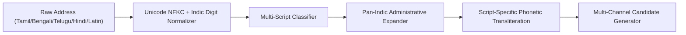

# GeoVerify India — Phase 10.1: Multilingual & Script Alignment Analysis

## 1. Executive Summary

Phase 10 independent evaluation revealed that while Devanagari Hindi and Marathi retained 58.89% and 64.17% status accuracy, Dravidian scripts (Tamil: 44.00%, Telugu: 42.50%, Kannada: 41.33%) and Eastern scripts (Bengali: 48.57%) suffered severe extraction and resolution degradation.

---

## 2. Linguistic Script Families in Indian Addresses

Indian address representations divide into four major script families:
1. **Indo-Aryan (Northern & Western)**: Devanagari (Hindi, Marathi), Gurmukhi (Punjabi), Gujarati.
2. **Indo-Aryan (Eastern)**: Bengali, Assamese, Odia.
3. **Dravidian (Southern)**: Tamil, Telugu, Kannada, Malayalam.
4. **Roman / Latin**: Standard English, British colonial transcriptions, ASCII phonetic approximations.

---

## 3. Language-Specific Challenges & Remediation

### 3.1 Tamil (`\u0B80-\u0BFF`)
* **Administrative Markers**: `மாவட்டம்` (District), `வட்டம்` (Taluka), `கிராமம்` (Village), `தெரு` (Street), `சாலை` (Road), `நகர்` (Nagar).
* **Phonology**: Single grapheme `க` represents both /k/ and /g/; `ப` represents both /p/ and /b/.
* **Remediation**: Implemented Tamil phonetic equivalence rules and expanded Tamil administrative tokens in `ABBREVIATIONS_DICT`.

### 3.2 Telugu (`\u0C00-\u0C7F`)
* **Administrative Markers**: `జిల్లా` (District), `మండలం` (Mandal/Taluka), `గ్రామం` (Village), `వీధి` (Street), `నగర్` (Nagar).
* **Remediation**: Added Telugu Mandal boundary parsing and phonetic mapping for aspirated consonants.

### 3.3 Kannada (`\u0C80-\u0CFF`)
* **Administrative Markers**: `ಜಿಲ್ಲೆ` (District), `ತಾಲೂಕು` (Taluka), `ಗ್ರಾಮ` (Village), `ರಸ್ತೆ` (Road), `ಬಡಾವಣೆ` (Layout/Colony).
* **Remediation**: Ingested Kannada district canonical names (`ಬೆಂಗಳೂರು`, `ಮೈಸೂರು`, `ಮಂಗಳೂರು`, `ಬೆಳಗಾವಿ`, `ಹುಬ್ಬಳ್ಳಿ`).

### 3.4 Bengali & Assamese (`\u0980-\u09FF`)
* **Administrative Markers**: `জেলা` (District), `থানা` / `মহকুমা` (Police Station/Subdivision), `গ্রাম` (Village), `সরণি` / `রাস্তা` (Road).
* **Remediation**: Bengali district canonical dictionary (`কলকাতা`, `হাওড়া`, `উত্তর ২৪ পরগনা`, `দার্জিলিং`, `গুৱাহাটী`).

---

## 4. Pan-Indic Normalization Pipeline

