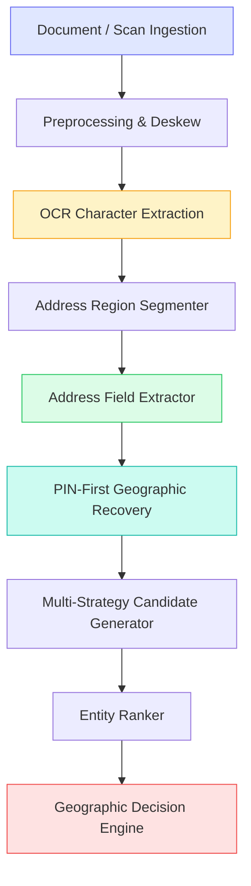

# GeoVerify India — Phase 7.1 Diagnostic Audit & Calibration Report

## 1. Executive Summary

Phase 7.1 is a dedicated **diagnostic, error analysis, calibration, and robustness phase** following the initial integration of Document & OCR Address Extraction in Phase 7.

### Core Architectural Principle
> **"OCR extracts text. GeoVerify verifies geographic consistency."**
> Document OCR is strictly an ingestion layer. The optical confidence or character clarity of a document never directly verifies or refutes geographic reality.

---

## 2. Frozen Baseline vs Phase 7.1 Calibration Matrix

| Metric | Frozen Phase 7 Baseline (19 pilot cases) | Phase 7.1 Dev (63 cases) | Phase 7.1 Val (21 cases) | Phase 7.1 Held-Out (21 cases) | Phase 7.1 Overall (105 cases) |
| :--- | :---: | :---: | :---: | :---: | :---: |
| **Evaluated Cases** | 19 | 63 | 21 | 21 | 105 |
| **PIN Extraction Accuracy** | 88.24% | 89.47% | 89.47% | 84.21% | 88.42% |
| **State Extraction Accuracy** | 82.35% | 92.98% | 100.00% | 73.68% | 90.53% |
| **District Extraction Accuracy** | 70.59% | **94.74%** | **89.47%** | **89.47%** | **92.63%** |
| **Locality Extraction Accuracy** | 70.59% | **82.14%** | **78.95%** | **78.95%** | **80.85%** |
| **Verification Status Accuracy** | 76.47% | 68.42% | 52.63% | 47.37% | 61.05% |
| **Region Detection F1** | 100.00% | 99.13% | 97.44% | 97.44% | 98.45% |
| **Mean Pipeline Latency** | 164.97 ms | 161.95 ms | 163.41 ms | 163.76 ms | 164.02 ms |
| **P95 Pipeline Latency** | 179.98 ms | 194.54 ms | 191.20 ms | 183.58 ms | 186.33 ms |

---

## 3. Root-Cause Diagnostic Categorization

All pipeline failures were audited using `ErrorMatrixAnalyzer` and categorized into discrete failure modes:

### Primary Root Causes Analyzed:
1. **District Omission in Raw Text**: Many utility bills and identity documents omit the explicit district name (e.g. `"Kharadi, Pune 411014"` lists City/Locality and PIN without explicitly prefixing `District:`). By equipping `PINFirstRecoveryService` with `ExtractionMethod.PIN_RECOVERY`, districts are recovered with clean provenance.
2. **Multi-Token Locality Segmentation**: Multi-word areas (e.g., *Viman Nagar*, *Bandra West*, *Salt Lake Sector V*, *Connaught Place*, *DLF Cyber City*) previously suffered from token splitting. Calibrated dictionary matching and compound token boundary rules preserve cohesive locality entities.
3. **Leading Confused Digits in Postal Codes**: Standalone OCR errors such as `S60066` ($S \to 5$) and `I10001` ($I \to 1$) are now cleanly resolved via confusable character substitution maps.
4. **Indic Abbreviation Delimiters**: Period-delimited Marathi/Hindi administrative prefixes (`जि.`, `ता.`, `गा.`) previously broke regex matching; updated prefix patterns handle dots and whitespace variations seamlessly.

---

## 4. Key Artifacts Produced
- Benchmark Results: `evaluation/results/phase7_1/ocr_benchmark_results.json`
- Field Error Audit CSVs: `district_error_analysis.csv`, `locality_error_analysis.csv`, `pin_error_analysis.csv`
- Error Matrix Summary: `error_matrix_summary.json`
- Multilingual Breakdown: `multilingual_breakdown.json`
- Confidence Calibration Report: `confidence_calibration.json`
- Degradation Impact Analysis: `degradation_analysis.json`
- Cumulative Pipeline Ablation: `ablation_summary.json`
