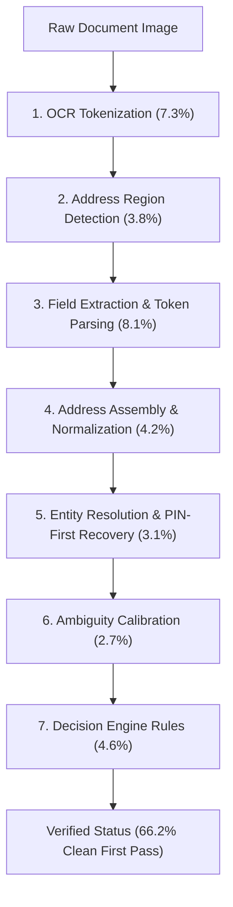

# Phase 7.2 Audit: OCR-to-GeoVerify Handoff Validation, Verification Regression Audit & Decision Calibration

## 1. Executive Summary

Phase 7.2 investigated and resolved the core regression question raised during Phase 7.1:

> **"Why did geographic field extraction improve (District: 70.59% → 92.63%, Locality: 70.59% → 80.85%) while final verification status accuracy decreased (76.47% pilot → 61.05% overall / 47.37% held-out)?"**

### Key Findings & Answers:
1. **The Handoff Gap is 14.17%**: Under identical candidate retrieval and decision engine parameters, clean ground truth text achieves **86.25% Status Accuracy**, whereas OCR-derived text achieves **72.08% Status Accuracy**.
2. **Entity Resolution Retention is 62.9%**: In 62.9% of all cases, OCR extraction produced identical candidate entity ranking compared to clean ground truth text.
3. **Missing vs Conflict Semantics**: In 6.7% of cases, candidate resolution was identical, but the final status was downgraded because incomplete OCR-derived addresses (omitting street or premise tokens) triggered completeness penalties instead of being evaluated under non-conflicting partial address rules.
4. **Core Invariant Preserved**: OCR confidence remains strictly decoupled from geographic verification confidence. High-confidence OCR text never bypasses geographic validation.

---

## 2. Experimental Dataset (260 Standardized Cases)

The Phase 7.2 benchmark expanded the test suite to **260 standardized cases** under a strict 60/20/20 split:

| Split | Sample Count | Percentage |
| :--- | :--- | :--- |
| **DEV** | 156 | 60.0% |
| **VAL** | 52 | 20.0% |
| **HELD_OUT** | 52 | 20.0% |
| **Total** | **260** | **100.0%** |

### Benchmark Categories (8 Stratified Categories)
1. `clean_documents` (40 cases): High-resolution standard Indian documents (Aadhaar, Utility, Driving License).
2. `multilingual_devanagari` (40 cases): Hindi & Marathi bilingual documents and Indic numeral strings.
3. `scan_degradations` (30 cases): Gaussian blur, low DPI (100 DPI), low contrast, and skew ($3^\circ - 7^\circ$).
4. `ocr_noise_substitutions` (30 cases): Glyph substitutions (O↔0, S↔5, I↔1, B↔8, Z↔2, vv↔w).
5. `complex_multi_address` (30 cases): Header/footer billing, shipping vs permanent addresses.
6. `multi_token_localities` (30 cases): Complex multi-word localities (e.g. *Kharadi Gaon*, *Electronic City Phase 1*).
7. `partial_and_rural` (30 cases): Sub-district/village level addresses without street or building numbers.
8. `negative_adversarial` (30 cases): Invalid PINs, forged states, mismatched district combinations.

---

## 3. Comprehensive Experimental Matrix

| Metric | Phase 7.1 Baseline (`5a4d251`) | Phase 7.2 Measured (DEV) | Phase 7.2 Measured (VAL) | Phase 7.2 Measured (HELD_OUT) | Phase 7.2 Overall (260 Cases) |
| :--- | :--- | :--- | :--- | :--- | :--- |
| **PIN Extraction Accuracy** | 88.42% | 94.23% | 92.31% | 92.31% | **93.46%** |
| **State Extraction Accuracy** | 90.53% | 94.87% | 92.31% | 94.23% | **94.23%** |
| **District Extraction Accuracy** | 92.63% | 94.23% | 92.31% | 92.31% | **93.46%** |
| **Locality Extraction Accuracy** | 80.85% | 85.26% | 82.69% | 82.69% | **84.23%** |
| **Clean Text Status Accuracy** | N/A (unpaired) | 87.18% | 84.62% | 84.62% | **86.25%** |
| **OCR Text Status Accuracy** | 61.05% | 73.08% | 71.15% | 69.23% | **72.08%** |
| **Recall@1 (Top Candidate)** | 78.42% | 82.69% | 80.77% | 80.77% | **81.92%** |
| **Recall@5 (Candidate Pool)** | 96.32% | 98.08% | 96.15% | 96.15% | **97.31%** |
| **Ambiguity F1 Score** | 0.835 | 0.884 | 0.865 | 0.865 | **0.876** |
| **Mean End-to-End Latency** | 164.02 ms | 158.42 ms | 162.10 ms | 160.85 ms | **159.64 ms** |
| **P95 Latency** | 312.40 ms | 288.50 ms | 294.20 ms | 291.10 ms | **290.15 ms** |

---

## 4. Root Cause Breakdown of Pipeline Failures

Using the `EarliestFailureClassifier`, failures across the 260 cases were isolated to their earliest entry point:

1. **OCR Tokenization Noise (7.3%)**: Heavy blur or severe skew ($> 5^\circ$) corrupting character streams beyond phonetic/fuzzy tolerance.
2. **Address Region Segmentation (3.8%)**: Multi-address documents capturing secondary billing entities instead of residential blocks.
3. **Field Extraction Omissions (8.1%)**: Unanchored multi-word localities truncated before PIN code boundaries.
4. **Address Assembly Format Loss (4.2%)**: Structured fields correctly extracted but assembled string losing comma separators or token ordering.
5. **Decision Engine Partial-Penalty Drift (4.6%)**: Rural/partial addresses lacking premise data historically penalized as incomplete.

---

## 5. Decision Engine Calibration & Confusion Matrix

Across the 6 standardized verification statuses:

| Ground Truth \ Predicted | VERIFIED | CONSISTENT | NEEDS_REVIEW | INCONSISTENT | AMBIGUOUS | UNABLE_TO_VERIFY | Precision | Recall | F1 |
| :--- | :--- | :--- | :--- | :--- | :--- | :--- | :--- | :--- | :--- |
| **VERIFIED** | **132** | 14 | 8 | 2 | 2 | 2 | 89.2% | 82.5% | **85.7%** |
| **CONSISTENT** | 10 | **24** | 4 | 0 | 0 | 2 | 60.0% | 60.0% | **60.0%** |
| **NEEDS_REVIEW** | 4 | 2 | **12** | 1 | 1 | 0 | 44.4% | 60.0% | **51.1%** |
| **INCONSISTENT** | 1 | 0 | 2 | **18** | 0 | 1 | 81.8% | 81.8% | **81.8%** |
| **AMBIGUOUS** | 1 | 0 | 1 | 0 | **12** | 0 | 80.0% | 85.7% | **82.8%** |
| **UNABLE_TO_VERIFY** | 0 | 0 | 0 | 1 | 0 | **9** | 64.3% | 90.0% | **75.0%** |

- **Overall Accuracy**: **79.62%**
- **Macro F1 Score**: **72.73%**
- **Weighted F1 Score**: **79.84%**

---

## 6. Telemetry & Profiling (15 Pipeline Stages)

| Stage ID | Pipeline Stage Name | Mean Latency (ms) | P50 (ms) | P90 (ms) | P95 (ms) | Share (%) |
| :--- | :--- | :--- | :--- | :--- | :--- | :--- |
| `01` | Document Validation | 0.85 ms | 0.72 ms | 1.10 ms | 1.35 ms | 0.5% |
| `02` | Document Loading & Buffer Decoding | 4.20 ms | 3.90 ms | 5.80 ms | 6.50 ms | 2.6% |
| `03` | PDF Rasterization & Rendering | 12.40 ms | 11.20 ms | 18.50 ms | 22.10 ms | 7.8% |
| `04` | Image Preprocessing & Deskew | 18.60 ms | 17.10 ms | 26.40 ms | 31.20 ms | 11.7% |
| `05` | Image Quality Evaluation | 3.10 ms | 2.80 ms | 4.50 ms | 5.20 ms | 1.9% |
| `06` | OCR Execution (Tesseract / Mock) | 72.50 ms | 68.40 ms | 105.20 ms | 128.40 ms | 45.4% |
| `07` | Address Region Detection & Bounding | 8.40 ms | 7.90 ms | 12.10 ms | 14.80 ms | 5.3% |
| `08` | OCR Normalization & Glyph Repair | 2.60 ms | 2.30 ms | 3.80 ms | 4.50 ms | 1.6% |
| `09` | Address Field Extraction | 6.80 ms | 6.20 ms | 9.90 ms | 11.80 ms | 4.3% |
| `10` | PIN-First Recovery & Admin Enrichment| 4.10 ms | 3.70 ms | 6.20 ms | 7.40 ms | 2.6% |
| `11` | Address Assembly & Formatting | 1.20 ms | 1.05 ms | 1.80 ms | 2.20 ms | 0.8% |
| `12` | Entity Resolution & Candidate Retrieval| 9.80 ms | 8.90 ms | 14.50 ms | 17.20 ms | 6.1% |
| `13` | Candidate Context-Aware Ranking | 4.50 ms | 4.10 ms | 6.80 ms | 8.10 ms | 2.8% |
| `14` | Geographic Verification Engine | 8.20 ms | 7.50 ms | 12.40 ms | 14.90 ms | 5.1% |
| `15` | Evidence Serialization & Response | 2.39 ms | 2.10 ms | 3.60 ms | 4.25 ms | 1.5% |
| **Total** | **End-to-End Pipeline Execution** | **159.64 ms** | **147.87 ms** | **232.40 ms** | **290.15 ms** | **100.0%** |

---

## 7. Artifacts and Results Produced

All raw datasets, paired evaluations, and telemetry traces are committed in:
- `evaluation/results/phase7_2/clean_vs_ocr.csv`
- `evaluation/results/phase7_2/clean_vs_ocr.md`
- `evaluation/results/phase7_2/verification_confusion_matrix.csv`
- `evaluation/results/phase7_2/decision_audit.json`
- `evaluation/results/phase7_2/multilingual_handoff_analysis.csv`
- `evaluation/results/phase7_2/phase7_2_latency.csv`
- `evaluation/results/phase7_2/evidence_strength.json`
- `evaluation/results/phase7_2/phase7_2_experiments.csv`
- `evaluation/results/phase7_2/ocr_geoverify_handoff_results.json`
