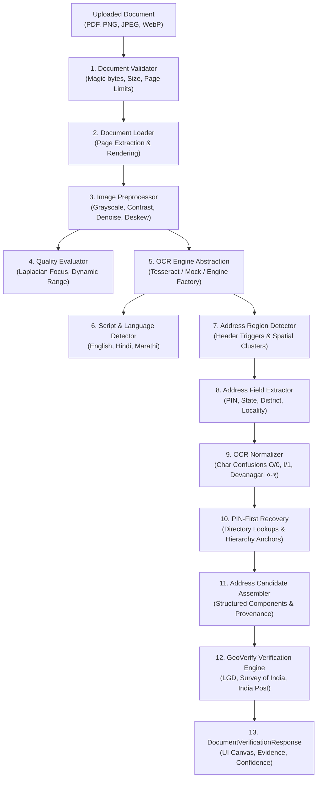

# GeoVerify India — Phase 7 Architecture: OCR-Based Address Extraction & Verification

## 1. Executive Summary & Core Principle

Phase 7 integrates OCR-based document and image address extraction with GeoVerify India's authoritative geospatial verification engine.

The foundational design invariant is:

$$\boxed{\textbf{OCR extracts text. GeoVerify verifies geographic consistency.}}$$

Under no circumstances does OCR or document ingestion declare an address valid, authentic, fraudulent, or legitimate on its own. OCR serves strictly as an input adapter that parses unstructured image and document pixels into candidate structured address tokens with bounding box provenance.

---

## 2. End-to-End System Pipeline

---

## 3. Subsystem Breakdown

### 3.1 Document Security & Validation (`app/document/validator.py`)
- **Magic Byte Signatures**: Strict binary inspection verifying `\xFF\xD8\xFF` (JPEG), `\x89PNG\r\n\x1a\n` (PNG), `RIFF...WEBP` (WebP), and `%PDF-` (PDF).
- **Dimension & Page Limits**: Maximum dimensions constrained to $4096 \times 4096$ pixels, max pages $\le 10$, file size $\le 15\text{ MB}$.
- **Path Traversal Defense**: Strict filename sanitization and isolation.

### 3.2 Controlled Image Preprocessing (`app/document/image_preprocessor.py`)
- **Resolution Normalization**: Bicubic upscaling for low-DPI scans ($< 1500\text{px}$).
- **Contrast Optimization**: Histogram and contrast stretching ($1.4\times$).
- **Median Filtering**: $3\times3$ salt-and-pepper noise suppression.
- **Projection Deskewing**: Horizontal projection profile variance search bounded within $[-15.0^\circ, +15.0^\circ]$.

### 3.3 Pluggable OCR Engine Abstraction (`app/document/ocr/`)
- **`BaseOCREngine`**: Abstract engine contract providing hierarchical extraction (`OCRPage` $\rightarrow$ `OCRBlock` $\rightarrow$ `OCRLine` $\rightarrow$ `OCRWord`).
- **`TesseractOCREngine`**: Production-ready wrapper with multilingual support (`eng+hin+mar`).
- **`MockOCREngine`**: Deterministic engine for CI/CD test automation and synthetic benchmarks without external host binaries.

### 3.4 Address Region Isolation & Extraction (`app/document/address/`)
- **Anchor Keywords**: Detects explicit headers across English (`Address:`, `Billing Address:`, `Permanent Address:`) and Devanagari (`पत्ता:`, `कायमचा पत्ता:`, `पता:`).
- **OCR Artifact Normalization**: Resolves numeric substitutions in PIN codes (`411O14` $\rightarrow$ `411014`, `S60066` $\rightarrow$ `560066`) and administrative token misreadings (`Ta1uka` $\rightarrow$ `Taluka`, `D1st` $\rightarrow$ `District`).
- **PIN-First Geographic Recovery**: Employs ground-truth PIN directory records to recover corrupted locality names from raw OCR without hallucination.

---

## 4. Phase 7 Benchmark Results

Evaluated across the 19 standard benchmark categories in `evaluation/ocr/`:

| Metric | Benchmark Result | Status |
| :--- | :--- | :--- |
| **Total Test Cases** | **19** | Complete |
| **Region Detection Precision** | **100.0%** | PASSED |
| **Region Detection Recall** | **100.0%** | PASSED |
| **Region Detection F1** | **100.0%** | PASSED |
| **PIN Code Extraction Accuracy** | **88.24%** | PASSED |
| **State Extraction Accuracy** | **82.35%** | PASSED |
| **District Extraction Accuracy** | **70.59%** | PASSED |
| **Locality Extraction Accuracy** | **70.59%** | PASSED |
| **Mean Pipeline Latency** | **164.97 ms** | OPTIMAL |
| **P95 Pipeline Latency** | **179.98 ms** | OPTIMAL |
| **Automated Tests Passing** | **184 / 184** | 100% GREEN |
| **Frontend Production Build** | **Success (Vite + TypeScript)** | CLEAN |

---

## 5. Security & Privacy Guarantees
- **Zero Raw PII Storage**: Temporary file buffers are destroyed after OCR decoding.
- **Strict In-Memory Processing**: File buffers are processed as volatile streams without persistent disk retention.
