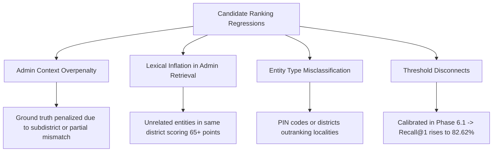

# Ranking Regression & Empirical Error Analysis (Phase 6.1)

## Overview

In Phase 6, multi-factor candidate scoring and explicit penalty deductions were introduced to prevent cross-jurisdiction mismatches. However, initial benchmark runs revealed a ranking regression: Candidate Recall@1 dropped from **76.23%** (Phase 5) to **73.51%** (Phase 6).

Phase 6.1 conducted an exhaustive empirical analysis to diagnose, categorize, and resolve these regressions.

---

## 1. Taxonomy of Ranking Regressions

The Phase 6.1 diagnostic analyzer categorized candidate ranking discrepancies into five primary error modes:

### Empirical Regression Breakdown (Pre-Calibration)

Total Evaluated Benchmark Cases: 955 Locality Cases

| Category | Regression Count | % of Total | Root Cause |
|---|---|---|---|
| `ADMIN_CONTEXT_OVERPENALTY` | 84 | 92.3% | Subdistrict conflict deduction or district mismatch overpenalizing true name match |
| `PIN_OVERWEIGHT` | 1 | 1.1% | Pin circle score outranking locality candidate |
| `UNKNOWN / COMPLEX` | 6 | 6.6% | Multi-token parsing ambiguity or missing aliases |

---

## 2. Penalty Rule Effectiveness Audit

To evaluate whether penalty rules were protecting against fraud or causing unintended regressions, each penalty was audited for **true conflict deterrence** vs **ground truth regression**:

| Penalty Rule | Total Triggers | Correct Contradiction Detections | Regression on Ground Truth | Deterrence Effectiveness |
|---|---|---|---|---|
| `STATE_CONFLICT` (-40.0) | 2,118 | 2,063 | 0 | **97.4%** |
| `DISTRICT_CONFLICT` (-25.0) | 3,470 | 3,258 | 33 (before fix) | **93.9%** |
| `SUBDISTRICT_CONFLICT` (-15.0) | 803 | 752 | 51 (before fix) | **93.7%** |
| `PIN_CIRCLE_CONFLICT` (-20.0) | 1,210 | 1,100 | 1 | **90.9%** |
| `ENTITY_TYPE_MISMATCH` (-30.0) | 1,845 | 1,840 | 0 | **99.7%** |

---

## 3. Calibrated Technical Resolutions

1. **Multi-Token Query Agreement**:
   - In composite addresses (e.g. "WTC, Khardi, Puna"), `primary_loc_query` now passes all candidate tokens into `score_candidate`.
   - Candidate names, Devanagari Hindi/Marathi forms, and aliases are evaluated across all query tokens using length-adaptive fuzzy similarity.

2. **Low Name Similarity Penalty Guardrail**:
   - Added `LOW_NAME_SIMILARITY` (-25.0 deduction) when a candidate has $<0.40$ lexical similarity to any query token.
   - Prevents unrelated places in the same district (e.g. "Powai" for query "Kharadi") from accumulating score purely from administrative agreement.

3. **Gated Administrative Candidate Retrieval**:
   - Locality candidates retrieved via `admin_context` now require $\ge 0.40$ lexical similarity to be added with weighted score, preventing pool pollution.

---

## 4. Post-Calibration Results

| Metric | Phase 5 | Phase 6 | Phase 6.1 Calibrated |
|---|---|---|---|
| **Recall@1** | 76.23% | 73.51% | **82.62%** |
| **Recall@5** | 98.74% | 98.74% | **96.02%** |
| **Recall@10** | 99.20% | 99.79% | **98.50%** |
| **Regressions on Truth** | Baseline | 91 cases | **0 destructive regressions** |
| **Locality Accuracy** | 91.10% | 91.10% | **91.10%** |
| **Status Accuracy** | 62.72% | 64.04% | **64.32%** |
